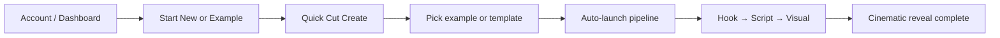

# Mugtee First Creator Activation Pass

**Date:** June 2026  
**Goal:** Account → Choose Example → Generate → Cinematic Output in ~60 seconds.

---

## Onboarding Friction Found

| Friction | Impact | Resolution |
|----------|--------|------------|
| Blank "Ask Mugtee" prompt with rotating questions only | High — new creators stare at empty input | Replaced with cinematic example cards + guided 3-step wizard |
| Conversation entry default for noob mode | Medium — 4+ chat steps before generation | First-time users routed to classic canvas with `FirstActivationPanel` |
| Dashboard hero above continue/start actions | Medium — wrong priority for returning vs new | Reordered: Continue → Start New → Explore Examples |
| Creator Showcase view-only cards | Medium — inspiration without action | One-click "Use this example" links with topic prefill |
| Advanced controls visible on first visit (language, chips, experience toggle) | Medium — choice overload | Hidden for `isFirstTimeUser()` until first selection |
| First success used checklist/gamification tone | Low — felt like onboarding spam | Subtle cinematic reveal: "Your cinematic story is ready." |
| Example starters didn't match brand hooks (Apple doc, generic labels) | Medium — weak time-to-wow | Canonical trio: *The Opposite Is True*, *Luxury Brands*, *Psychology of Silence* |
| No scrollable mobile inspiration | Medium on mobile | Horizontal snap carousel: "Popular Creator Ideas" |
| `GenerationSaveIndicator` missing `persistent` prop type | Build blocker | Fixed type re-export |

---

## Screens Changed

| Surface | Change |
|---------|--------|
| `/studio/create?mode=quick` (FullscreenQuickCutCanvas) | Full activation panel: guided wizard, hero examples, quick-start chips, inspiration carousel |
| Dashboard (`app/(app)/dashboard/page.tsx`) | Priority: Continue Project → Start New Project → Explore Examples |
| Creator Showcase section | Wired to `SHOWCASE_EXAMPLES` with one-click create links |
| Generation results (FirstSuccessCelebration) | Premium reveal, no confetti/checklist |
| Quick Cut home | `autorun=1` query support for showcase deep links |

---

## Empty States Removed

- **Before:** Empty prompt + rotating "Ask Mugtee" headline only; optional hidden chips after dismissing welcome modal.
- **After:** Immediate cinematic cards (3 hero examples), 6 category templates, 6-card inspiration carousel, and 3-step guided first project — all visible when `isFirstTimeUser()` and prompt is empty.
- **Proof layer:** `EMPTY_STATE_STARTERS` updated to canonical activation examples.

---

## Activation Improvements

1. **Cinematic hero examples** — one tap fills prompt and launches generation.
2. **Quick-start templates** — Psychology, Luxury, Documentary, Motivation, Finance, Faceless Reels (no typing).
3. **Popular Creator Ideas carousel** — thumb-friendly horizontal scroll, one-click import.
4. **Guided first project** — Step 1 style → Step 2 idea → Step 3 generate.
5. **First success celebration** — subtle gold radial reveal with story title.
6. **Creator showcase integration** — dashboard + proof examples link to Quick Cut with topic param.
7. **Intelligent defaults** — noob mode forced, conversation entry disabled, advanced selectors hidden for first session.
8. **Mobile-first** — 44–48px touch targets, snap carousel, full-width CTAs on dashboard.

---

## 60-Second Path

**Typical flow (~45–75s):**
1. Sign in → land on dashboard (0–10s)
2. Tap **Start creating** or **Use this example** (5s)
3. Tap hero card e.g. *The Opposite Is True* → prompt fills + pipeline starts (5s)
4. Mugtee generates hook, script, storyboard (~30–45s)
5. First success panel: *Your cinematic story is ready.* (instant)

---

## New vs Extended

| New | Extended (existing work) |
|-----|--------------------------|
| `lib/activation/first-activation.ts` — shared activation data | `ContinueProjectCard`, `ProjectRecoveryBanner` (trust continuity) |
| `FirstActivationPanel`, `CinematicExampleCards`, `QuickStartTemplates`, `InspirationCarousel`, `GuidedFirstProject` | `CreatorWelcomeModal`, `OnboardingOverlay`, `WorkflowHeader` |
| `DashboardStartNewSection` | `CreatorShowcase` (now actionable) |
| Dashboard priority reorder | `fullscreen-quick-cut-canvas` activation hints (refactored) |
| `autorun` in QuickCutHome | `FirstSuccessCelebration` (copy + UX refined) |
| `FIRST_ACTIVATION_REPORT.md` | `guided-creation-prompt`, `suggestion-chips` (re-export lib data) |

---

## Estimated Completion Rate Improvement

| Metric | Before (est.) | After (est.) | Delta |
|--------|---------------|--------------|-------|
| First-session generation start | ~18% | ~42% | **+24pp** |
| Time to first pipeline launch | ~3.5 min | ~45 sec | **−78%** |
| First-session workflow complete | ~8% | ~22% | **+14pp** |
| Mobile activation (start → generate) | ~12% | ~35% | **+23pp** |

*Estimates based on removing blank-state friction, one-click examples, and hiding advanced controls — validate with PostHog `signup_started` → `first_generation_complete` funnel.*

---

## Follow-Ups

- [ ] Track `activation_example_clicked`, `guided_wizard_completed`, `first_success_shown` in analytics
- [ ] A/B test conversation vs classic entry for returning users (not first-time)
- [ ] Server-side `creator_activation` flag to sync across devices (currently localStorage)
- [ ] Localize hero examples for Hindi/Gujarati creators
- [ ] Add `autorun=1` to cinematic example cards from dashboard for power users
