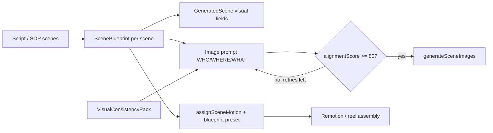

# Mugtee Output Alignment Pass

## Objective

One story → one scene → one visual direction. Script beats, storyboard stills,
and motion presets must describe the same scene. `SceneBlueprint` is the single
source of truth; image prompts and animation are derived from it—not from
independent raw-script or generic template paths.

## Audit: Mismatches Found

| Area                                                        | Before                                                                                  | Risk                                                       |
| ----------------------------------------------------------- | --------------------------------------------------------------------------------------- | ---------------------------------------------------------- |
| Scene creation (`/api/generate-scenes`)                     | Script → scenes with `buildSceneImagePrompt(scene)` from description/visualPrompt       | Image body could drift from beat intent                    |
| Image gen (`generate-scene-images.ts`)                      | `buildSceneImagePrompt` from `scene.description` / `visualPrompt` when no custom prompt | WHO/WHERE/WHAT not structured; generic fallbacks           |
| Motion (`assignSceneMotion` / `selectMotionPresetForScene`) | Keyword hints on `movementStyle` + pacing role defaults                                 | Emotion (suspense, luxury, etc.) not mapped systematically |
| Continuity (`visual-continuity-system.ts`)                  | Prior-scene palette/env only                                                            | No locked character/style reference block in every prompt  |
| Validation (`validation.ts`)                                | Hook/script/scene repetition checks                                                     | No script↔image↔motion alignment score                     |
| Creator controls                                            | Story bible locks only                                                                  | No per-project animation/style tuning without full regen   |

## Alignment Improvements

### Phase 1 — Scene Blueprint System

- New `lib/cinematic/scene-blueprint.ts` with `SceneBlueprint` fields:
  `sceneId`, `narrativeGoal`, `emotion`, `location`, `subject`, `action`,
  `cameraAngle`, `lighting`, `colorPalette`, `movementStyle`.
- Built after scene generation via `buildBlueprintsForScenes` /
  `buildSceneBlueprintFromScene`.
- Stored in workflow state (`sceneBlueprints`) and persisted in project
  `captions` JSON.

### Phase 2 — Script → Image Alignment

- `buildSceneOnlyImageBody` uses blueprint WHO/WHERE/WHAT/MOOD when
  `ctx.sceneBlueprint` is set.
- `generate-scene-images` injects `VisualConsistencyPack` (`characterReference`,
  `environmentReference`, `visualStyleReference`).
- `/api/generate-scenes` returns `sceneBlueprints` and applies
  `applyBlueprintsToScenes` before response.

### Phase 3 — Image Consistency Layer

- `buildVisualConsistencyPack` aggregates character, environment, and visual
  identity across scenes.
- Injected into every blueprint image prompt; strict mode locks character
  silhouette/wardrobe language.

### Phase 4 — Animation Intelligence

- `motionPresetIdFromBlueprint` maps emotion → preset (suspense → push-in,
  documentary → drift, luxury → reveal, emotional → close-up, action →
  tracking).
- `assignSceneMotion` accepts `{ sceneBlueprints, outputAlignmentControls }` and
  passes `blueprintPresetId` into `rulesMotionDirector`.

### Phase 5 — Scene Validation

- `lib/cinematic/output-alignment.ts`: `scoreSceneAlignment` (0–100), threshold
  **80** (`ALIGNMENT_PASS_THRESHOLD`).
- Failed scenes: up to **2** prompt rebuilds via `rebuildAlignedImagePrompt`
  before image API call.
- API returns `alignmentResults` per scene.

### Phase 6 — Storyboard Continuity

- `validateSequenceCoherence` checks location/subject/emotion progression across
  blueprint sequence.
- Returned as `sequenceCoherence` from image generation API.

### Phase 7 — Creator Controls

- `OutputAlignmentControls`: visual style note, character consistency, animation
  style, camera language.
- UI in `components/cinematic/storyboard-continuity-panel.tsx` (Output alignment
  section).
- `setOutputAlignmentControls` refreshes blueprints and scenes without full
  `runPipeline`.

## Files Changed

| File                                                   | Role                                                                |
| ------------------------------------------------------ | ------------------------------------------------------------------- |
| `lib/cinematic/scene-blueprint.ts`                     | Types, blueprint build, consistency pack, motion mapping            |
| `lib/cinematic/output-alignment.ts`                    | Scoring, validation, prompt rebuild                                 |
| `lib/cinematic/generation.ts`                          | Blueprint-aware `buildSceneOnlyImageBody`; captions persistence     |
| `lib/cinematic/generate-scene-images.ts`               | Blueprint prompts, alignment loop, API metadata                     |
| `lib/motion/motion-presets.ts`                         | Blueprint-driven `assignSceneMotion` / `selectMotionPresetForScene` |
| `lib/motion/motion-director-rules.ts`                  | `blueprintPresetId` override                                        |
| `app/api/generate-scenes/route.ts`                     | Blueprint generation on all scene sources                           |
| `app/api/generate-images/route.ts`                     | Accept/pass blueprints + controls                                   |
| `stores/quick-cut-generation-store.ts`                 | State, pipeline, fetch, persistence, controls actions               |
| `lib/cinematic/quick-cut/project-hydration.ts`         | Hydrate blueprints + controls from captions                         |
| `lib/cinematic-projects.ts`                            | Archive/patch captions fields                                       |
| `lib/cinematic/quick-cut/orchestrate-quick-cut.ts`     | Server orchestration blueprint path                                 |
| `components/cinematic/storyboard-continuity-panel.tsx` | Creator alignment controls UI                                       |

## Architecture Flow

## Validation Threshold Behavior

- **Pass:** `alignmentScore >= 80` and fewer than 2 blocking issues.
- **Fail:** Rebuild image prompt from blueprint + consistency pack (max 2
  attempts), then proceed to image generation (pipeline does not hard-abort the
  run).
- **Weights:** script match 35%, image prompt match 45%, motion match 20%.

## Follow-ups

1. Surface per-scene alignment scores in storyboard UI (badge on tiles).
2. Block export when any scene `alignmentScore < 80` (optional strict mode).
3. LLM pass to refine blueprints from script (today: deterministic extraction).
4. Dedicated DB column for `scene_blueprints` if captions JSON size becomes an
   issue.
5. Unit tests for `scoreSceneAlignment` and `motionPresetIdFromBlueprint`.
