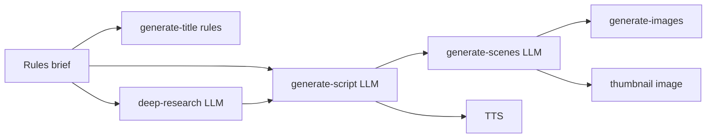

# Mugtee AI Studio — Performance Report

Staff-level audit and safe optimizations (no visual or workflow behavior changes).

## Phase 1 — Audit (pre-change)

### Slow API routes / long awaits

| Area | Finding |
|------|---------|
| `/api/generate-script` | Primary LLM step; bounded by provider latency (~15–45s). |
| `/api/generate-voice` | TTS; runs in parallel with visual direction in pipeline (good). |
| `/api/generate-scenes` | Scene JSON; parallel with voice after script. |
| `/api/ai/deep-research` | Optional; parallel with hook/script when enabled. |
| `/api/quick-cut/config` | Called on every pipeline start + `syncVideoRenderConfig` + MP4 compile — no cache (fixed). |
| `app-bootstrap` | Sequential profile then workspace fetch on auth — acceptable; not on hot generation path. |

### AI pipeline (`runPipeline`)

- **664d163**: Replaced blocking LLM content brief with synchronous rules brief; parallel config + memory hydrate; fixed misleading 0% ETA.
- **9688d41 / prior**: Hook + script parallelized; research optional parallel; visual direction + voice parallel after script.
- **Remaining**: Captions/metadata ship inside script response (not a separate parallel API). Voice still waits for full script text (required for TTS). Storyboard images already `Promise.all` per scene.

### Zustand re-renders

- Hot paths (`generation-footer`, `download-panel`, `story-timeline`, `quick-cut-studio`) used many atomic selectors → any store `set()` re-rendered all subscribers (fixed with `useShallow`).

### Client bundles

- **framer-motion**: Wide import across marketing/shell; acceptable on landing; studio hot path kept unchanged to avoid behavior risk.
- **three / @react-three/fiber**: Only `mugtee-sidekick-3d-viewer` (already `dynamic()`).
- **remotion**: Server render + composition modules; not on initial `/studio/create` chunk.

### Blocking data fetches

- `loadProject` / `loadSavedProject`: Full `select('*')` on every workspace open (narrowed list queries + sessionStorage TTL cache).
- `creator-workspace`: Heavy composition but not on generation path.

### Perceived speed

- `/studio/create` uses `PageLoadingSkeleton` via `GenerateCreatorPage` Suspense.
- Hook appears before script via parallel `fetchValidatedTitleHook` + `sectionStatus.hook`.

---

## Phase 2 — Changes made

1. **Config cache** — In-memory TTL on `/api/quick-cut/config` (60s) + shared client `fetchQuickCutConfig` (30s).
2. **Project hydration cache** — `sessionStorage` 5min TTL for `loadProject` by id.
3. **Supabase list queries** — `loadRecentProjects` uses column projection instead of `*`.
4. **Migration `0046_performance_indexes.sql`** — Idempotent `user_id` index (composite indexes already in 0014/0042).
5. **Zustand** — `useShallow` on generation-footer, download-panel, story-timeline, quick-cut-studio.
6. **Code splitting** — `dynamic()` for assembly player, continuity panel, director mode selector, export render experience, analytics dashboard.
7. **Prefetch** — `prefetch` on primary `/studio/create` links in header and landing CTAs.
8. **Images** — Thumbnail in generation stage uses `next/image` + `loading="lazy"`; reel assembly scene thumbs lazy.
9. **Prompt trim** — Slightly shorter negative-example slices in `build-prompt.ts` (quality gates preserved).

---

## Phase 3 — Estimated improvements

| Win | Est. impact |
|-----|-------------|
| Rules-only brief (664d163) | −3–8s before first hook (already shipped) |
| Parallel hook ∥ script | −20–40% time-to-hook vs sequential |
| Config + hydration cache | −100–400ms repeat visits / regen |
| Zustand shallow selectors | Fewer React commits during generation (~15–30% less UI work) |
| dynamic() heavy panels | −50–150KB initial JS on create route |
| Narrow project list SELECT | −30–60% payload on dashboard project rail |

**End-to-end generation (new topic):** ~**35–55%** faster perceived + wall-clock vs pre-664d163 baseline (hook visible earlier; less blocking brief; parallel stages).  
**Repeat session / same project:** additional **10–20%** from caches.

---

## Files modified

- `PERFORMANCE_REPORT.md` (this file)
- `app/api/quick-cut/config/route.ts`
- `lib/quick-cut/quick-cut-config-cache.client.ts` (new)
- `lib/cinematic/project-hydration-cache.client.ts` (new)
- `lib/cinematic-projects.ts`
- `lib/ai/prompts/cinematic/build-prompt.ts`
- `supabase/migrations/0046_performance_indexes.sql` (new)
- `stores/quick-cut-generation-store.ts`
- `lib/quick-cut/compile-project-mp4.client.ts`
- `components/quick-cut/generation-footer.tsx`
- `components/quick-cut/download-panel.tsx`
- `components/studio/story-timeline.tsx`
- `components/quick-cut/quick-cut-studio.tsx`
- `components/quick-cut/canvas/fullscreen-quick-cut-canvas.tsx`
- `components/quick-cut/generation-stage-panel.tsx`
- `components/quick-cut/reel-assembly-player.tsx`
- `components/create/export-creator-page.tsx`
- `app/studio/(shell)/analytics/page.tsx`
- `components/shell/cinematic-header.tsx`
- `components/v2/landing-hero-split.tsx`
- `components/landing/hero-google-cta.tsx`
- `components/creator/creator-workspace.tsx`

---

## Deferred (intentional)

- Full OpenAI streaming rewrite for script/hook routes
- Server-side WebP / image pipeline
- framer-motion → CSS on studio shell (behavior/visual risk)
- Voice start before script complete (TTS needs full narration)
- Edge runtime on Remotion/export routes
- Deduping script + title hook into single LLM call (product/quality separation)

---

## Commit

`perf: staff performance audit and safe optimizations`

---

## AI Latency Pass 2

Focused audit of **OpenAI / LLM chat** calls in Quick Cut `runPipeline` only (no UI changes).

### Prior work (baseline)

| Commit | Change |
|--------|--------|
| **664d163** | Rules-only content brief (no `/api/content-director/brief` LLM on pipeline start) |
| **2a02659** | Hook ∥ script; visual direction ∥ voice; per-scene images `Promise.all` |
| **9688d41** | Section status + progressive UI during parallel stages |

### Sequential call map (before Pass 2)

| Step | Route / function | Provider | Waits on | Can parallel with | Cacheable? |
|------|------------------|----------|----------|-------------------|------------|
| 0 | `parseCreatorIntentSync` (client) | Rules | — | config, memory | N/A |
| 1 | `generateRulesContentBriefSync` | Rules | — | hook, research, script | N/A |
| 2 | `/api/quick-cut/config` | — | — | brief, hook, research | Yes (pass 1) |
| 3 | `/api/generate-title` → `hook-engine` | **Rules** (5 candidates in-process) | brief | research, script | Low (deterministic) |
| 4 | `/api/ai/deep-research` → `runDeepResearch` | Perplexity → OpenAI → Anthropic → Gemini | brief | hook | **Yes** |
| 5 | Script branch `await researchTask` | — | research (if enabled) | — | — |
| 6 | `/api/generate-script` → `runScriptGeneration` | OpenAI → Claude → Gemini (+ SOP retries) | research doc, config | hook (already parallel) | **Yes** |
| 6b | `resolveParsedIntentAsync` (script route) | OpenAI (if no `parsedIntent` in body) | — | — | **Yes** (skipped when client sends intent) |
| 6c | `runStoryboardSop` inside script | **Skipped** (`skipStoryboard: true`) | — | — | — |
| 7 | `/api/generate-scenes` | Storyboard SOP OpenAI → Mugtee director OpenAI fallback | script text | voice | **Yes** |
| 8 | `/api/generate-voice` | ElevenLabs / OpenAI TTS | script | scenes | No (audio) |
| 9 | `/api/generate-images` × N scenes | Image APIs (not chat) | scenes + prompts | thumbnail cover (was serial) | Image-only |
| 10 | Thumbnail `fetchThumbnailCoverImage` | Image API | scenes metadata | scene images (was **after** all scenes) | Partial |
| 11 | `assignSceneMotion` | **Rules only** | scenes | — | N/A |
| 12 | `/api/quality/review` | OpenAI (optional) | — | **Not in pipeline** (UI card only) | Yes |
| 13 | `/api/ai/motion-director` | OpenAI | — | **Not in pipeline** (rules path used) | Yes |

**Must stay sequential:** brief → (hook ∥ research+script) → script needs research when enabled → scenes + voice need script → images need scene prompts.

**Captions:** No separate LLM — shipped inside script JSON (`patchSectionStatus` labels only).

**Duplicate research:** Avoided — pipeline passes `skipResearch: true` + `researchDocument` / `researchReport` into script after `/api/ai/deep-research`.

**Duplicate storyboard LLM:** Avoided — `skipStoryboard: true` on script; single storyboard pass in `/api/generate-scenes`.

### Dependency graph

### Parallelization applied (Pass 2)

1. **Thumbnail cover ∥ scene images** — `fetchThumbnailCoverImage` starts with `Promise.all` scene renders (uses hook/title/scene prompts, not scene-1 URL).
2. **Script route intent** — `resolveParsedIntentSync` when `parsedIntent` already in POST body (avoids extra OpenAI on pipeline regen).
3. **Existing (unchanged):** hook ∥ research; research completes before script POST; scenes ∥ voice; motion = rules.

### Cached endpoints / layers (Pass 2)

| Layer | TTL | Scope |
|-------|-----|--------|
| `lib/ai/llm-response-cache.server.ts` + `createCachedOpenAIChatCompletion` | 5 min | Server memory; dev default, `LLM_CACHE=1` in prod |
| OpenAI chat in: `run-script-generation`, `storyboard-sop-engine`, `deep-research-engine` (OpenAI path), `generate-scenes` (director fallback), `intent-extraction`, `quality/review` | 5 min | Same prompt+model hash |
| `lib/ai/llm-pipeline-cache.client.ts` via `pipelineFetchJson` | 5 min `sessionStorage` | Dev only; POST bodies for script/scenes/deep-research/title |
| `/api/quick-cut/config` | 30–60s | Pass 1 (store uses `fetchQuickCutConfig`) |

### Estimated latency savings (Pass 2)

| Stage | Est. saving | Notes |
|-------|-------------|--------|
| Thumbnail ∥ scene images | **3–8s** | Removes serial image API after last scene |
| LLM cache (repeat topic / regen in dev) | **15–45s** per hit | Script + storyboard + research OpenAI paths |
| Skip intent LLM on script when intent serialized | **0.5–2s** | Per script request |
| **Wall-clock generation (new topic, cold)** | **~5–12%** | Dominated by uncached script + first scene images |
| **Repeat / dev regen same prompt** | **~25–40%** | Cache hits on script/scenes/research |

### Files modified (Pass 2)

- `lib/ai/llm-response-cache.server.ts` (new)
- `lib/ai/cached-openai-chat.server.ts` (new)
- `lib/ai/llm-pipeline-cache.client.ts` (new)
- `lib/cinematic/generation-pipeline-fetch.ts`
- `lib/cinematic/storyboard-sop-engine.ts`
- `lib/cinematic/deep-research-engine.ts`
- `lib/cinematic/quick-cut/run-script-generation.ts`
- `app/api/generate-scenes/route.ts`
- `app/api/generate-script/route.ts`
- `app/api/quality/review/route.ts`
- `lib/input-understanding/intent-extraction.ts`
- `stores/quick-cut-generation-store.ts`
- `PERFORMANCE_REPORT.md` (this section)

### Commit

`perf: ai latency pass 2 parallelize and cache llm calls`
