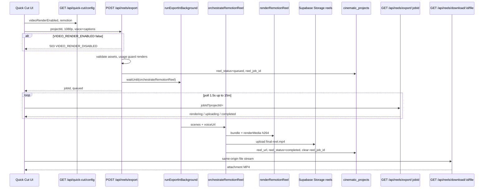
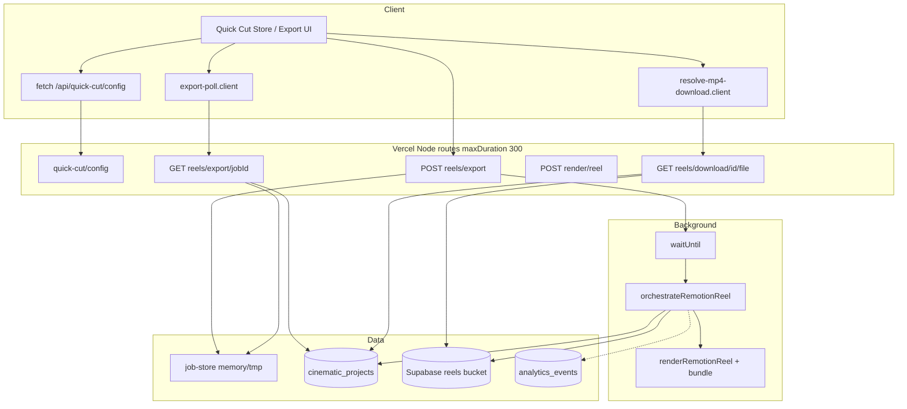

# MP4 Export System Audit (Phase 1)

**Date:** 2026-06-03  
**Scope:** Read-only audit of Quick Cut / cinematic reel MP4 export on `main` (HEAD `1aa88e8`) plus uncommitted in-flight tracking files noted below.  
**Production:** https://mugtee.in (Vercel)  
**User context:** ~25 users, asset exports work, **0 successful MP4 exports** reported.

---

## 1. Existing export flow (client → API → render → storage → download)

### Primary path (Quick Cut — saved `cinematic_projects` row)

This is what most creators hit after generation completes.



**Key files:**

| Step | File |
|------|------|
| Export CTA / compile | `lib/export/use-unified-export-actions.client.ts`, `lib/quick-cut/compile-project-mp4.client.ts` |
| Generation-time render | `stores/quick-cut-generation-store.ts` → `requestVideoRender()` |
| Queue export | `app/api/reels/export/route.ts` → `lib/reels/export-api.ts` `queueReelExportForProject()` |
| Background | `lib/export/export-background.server.ts` (`waitUntil` on Vercel) |
| Render | `lib/video/orchestrate-remotion-reel.ts` → `lib/remotion/render-reel.server.ts` |
| Persist | `lib/video/reel-storage-upload.ts` |
| Poll | `lib/reels/export-poll.client.ts` → `app/api/reels/export/[jobId]/route.ts` |
| Download | `lib/quick-cut/resolve-mp4-download.client.ts` → `app/api/reels/download/[projectId]/file/route.ts` |

### Secondary path (no saved project / direct render)

- Client: `POST /api/render/reel` with `scenes`, `voiceUrl`, optional `async: true`
- Poll: `GET /api/render/reel/status/[jobId]` (in-memory job store only — **no DB fallback**)
- Used when `savedProjectId` is missing in `requestVideoRender()` (`stores/quick-cut-generation-store.ts` ~1648)

### Asset-only exports (working today)

- Script TXT/DOCX, scene JPG ZIP, narration MP3, Creator Pack / platform ZIPs
- Text: client-side + `POST /api/workspace/exports` logging
- ZIP MP4: `lib/quick-cut/fetch-mp4-bytes.client.ts` (bcd424f) — compiles via `/api/reels/export` if no `videoUrl`

### Legacy / parallel pipelines (not Quick Cut default)

| Pipeline | Entry | Renderer |
|----------|-------|----------|
| Faceless / workspace | `POST /api/render-video` | FFmpeg slides and/or Runway (`lib/video/orchestrate-faceless-video.ts`) |
| Timeline editor | `POST /api/timeline/render` | `lib/timeline/render-timeline-project.ts` |
| Cinematic compile screen | `POST /api/cinematic/render/prepare` | Metadata assembly (`orchestrateRender`) — **not final MP4** |
| Runway clips | `POST /api/ai/runway-video`, `generate-scene-video` | Runway / Seedance per scene |

---

## 2. Export routes and API endpoints

### MP4 reel (Quick Cut production path)

| Method | Route | Purpose |
|--------|-------|---------|
| GET | `/api/quick-cut/config` | Public flags: `videoRenderEnabled`, `remotion`, `ffmpeg` |
| POST | `/api/reels/export` | Queue project reel export (`maxDuration: 300`) |
| GET | `/api/reels/export/[jobId]?projectId=` | Poll job (memory → `reel_job_id` → project row) |
| GET | `/api/reels/download/[projectId]` | JSON validation status + `reelUrl` |
| GET | `/api/reels/download/[projectId]/file` | Stream MP4 attachment |
| POST | `/api/render/reel` | Direct Remotion render (sync/async) |
| GET | `/api/render/reel/status/[jobId]` | Poll in-memory job only |

### Related video / export APIs

| Method | Route | Notes |
|--------|-------|-------|
| POST | `/api/timeline/render` | Timeline-based reel; same `VIDEO_RENDER_ENABLED` gate |
| POST | `/api/render-video` | FFmpeg/Runway faceless; **no** `isVideoRenderEnabled()` check |
| GET | `/api/render-video/status/[jobId]` | Legacy poll |
| GET | `/api/render-video/asset/[jobId]` | Local dev asset URL |
| POST | `/api/compile-video` | Separate compile entry (grep if used from UI) |
| POST | `/api/workspace/exports` | Log text export events |
| GET | `/api/analytics/export-metrics` | Export metrics |
| GET | `/api/admin/export-funnel` | Founder funnel (needs admin env + **uncommitted** tracking) |

### Client pages

- `app/(app)/create/[projectId]/export/page.tsx`, `app/studio/(shell)/create/[projectId]/export/page.tsx`
- Export UI: `components/quick-cut/export-tabbed-panel.tsx`, `lib/export/use-unified-export-actions.client.ts`

---

## 3. FFmpeg usage

| Use case | Location | Active for Quick Cut MP4? |
|----------|----------|---------------------------|
| **Remotion encode** | `@remotion/renderer` `renderMedia` codec `h264` | **Yes** — primary reel path (Chromium + internal ffmpeg) |
| **Mock MP4** | `lib/video/render-pipeline.ts` `renderMockMp4` when `VIDEO_RENDER_MOCK=true` | Dev only |
| **Faceless / Runway assembly** | `lib/video/render-pipeline.ts`, `orchestrate-faceless-video.ts` | `/api/render-video` only |
| **Cinematic metadata** | `lib/cinematic/execution/render/ffmpeg-film-assembly.ts` | Hints only; no file output |
| **Motion presets** | `motion_presets.ffmpeg_filter` (DB) | Future / alternate providers |

**Binary resolution:** `lib/video/ffmpeg-path.server.ts` — documents Vercel/serverless limitations; `isFfmpegAvailable()` true when `VIDEO_RENDER_MOCK=true`.

**Logging mislabel:** `orchestrate-remotion-reel.ts` logs `ffmpegStarted` / `ffmpegCompleted` for Remotion stages (historical naming).

---

## 4. Video rendering logic

### Quick Cut final MP4: **Remotion** (not Runway/Seedance for assembly)

1. `bundle()` entry `lib/remotion/compositions/index.ts` (NFT-traced on Vercel via `next.config.js` — commit **3ba10a1**)
2. Composition `ReelComposition` (`REEL_COMPOSITION_ID`), 1080×1920, Ken Burns via `lib/motion/apply-scene-motion.ts`
3. Downloads scene images + voice (+ optional music) in temp dir (`lib/video/download-asset.ts`)
4. `renderMedia` → local `os.tmpdir()/mugtee-reel-{jobId}.mp4`

### Per-scene AI video (separate from MP4 compile)

- **Runway** / **Seedance**: `generate-scene-video`, env `VIDEO_GENERATION_*` — produces clips, not the default reel export assembler.

### Cinematic “render prepare”

- `POST /api/cinematic/render/prepare` returns blueprint/metadata — **does not** write `reel_url`.

---

## 5. Storage upload logic (Supabase)

| Bucket | Path | Code |
|--------|------|------|
| `reels` (primary) | `{projectId}/final-reel.mp4` | `uploadReelMp4()` in `lib/video/reel-storage-upload.ts` |
| `project-assets` (fallback) | `{userId}/{projectId}/final-reel.mp4` | On `reels` upload error |
| Thumbnail | `{projectId}/reel-thumb.jpg` in `reels` | Optional after render |

**DB columns** (`cinematic_projects`, migrations `0022`, `0032`):

- `reel_url`, `reel_status`, `reel_rendered_at`, `reel_job_id`
- Also `video_url`, `thumbnail_url` updated on success
- `project_assets` row inserted (`kind: video`, `pipeline: remotion-reel`)

**Public URL:** `getPublicUrl` on `reels` bucket — requires bucket + RLS policies from migration `0022_reel_render.sql`.

**Download verification:** `verifyReelFileExists()` HEAD/range on public URL, fallback `storage.download` (`lib/export/reel-url-validation.server.ts`). On failure, API may return same-origin `/api/reels/download/{id}/file`.

---

## 6. Queue / background processing

**No `export_jobs` table** (grep: zero matches).

| Mechanism | Behavior |
|-----------|----------|
| In-memory + `/tmp` JSON | `lib/video/job-store.ts` — lost across cold starts; poll falls back to DB |
| Project row | `reel_job_id`, `reel_status` — durable poll source |
| Vercel `waitUntil` | `runExportInBackground()` keeps render alive after HTTP 200 |
| Usage limit | `guardUsageLimit(userId, 'renders')` on export POST |
| Client poll | `REEL_EXPORT_MAX_MS` = 15 min; `REEL_EXPORT_STUCK_MS` = 30 s DB recovery |

**Risk:** If `waitUntil` fails or function times out at 300s before render completes, job may stay `rendering` / `failed` with no `reel_url`.

`vercel.json` only sets `maxDuration: 300` for `generate-script` and `deep-research` — reel routes rely on **route segment** `export const maxDuration = 300` (present on `reels/export`, `render/reel`, `timeline/render`).

---

## 7. Supabase export-related schema

### Tables / columns

- **`cinematic_projects`**: `reel_url`, `reel_status`, `reel_job_id`, `reel_rendered_at`, `video_url`, `timeline_json`, `generation_error`, `scene_motion`, `voice` (json)
- **`project_assets`**: exported video metadata
- **`analytics_events`**: funnel events (`mp4_started`, `mp4_failed`, etc.) — see §8 tracking
- **`motion_presets`**: `ffmpeg_filter`, `remotion_config` (0038)

### Views (in-flight, not on `main` yet)

- **`mp4_export_failures`** — migration `supabase/migrations/0048_mp4_export_funnel.sql` (**untracked** in working tree)

### Storage

- Bucket **`reels`**: public read, authenticated upload/update policies

---

## 8. Failure points (with code evidence)

### P0 — Production render gate off

```10:15:lib/cinematic/quick-cut/video-render-enabled.ts
export function isVideoRenderEnabled(): boolean {
  return (
    process.env.VIDEO_RENDER_ENABLED === 'true' ||
    process.env.VIDEO_RENDER_MOCK === 'true' ||
    devMockRenderDefault()
  )
}
```

- **Local `npm run dev`:** mock/render on by default (`devMockRenderDefault()` unless `VIDEO_RENDER_MOCK=false`).
- **Vercel production:** requires explicit `VIDEO_RENDER_ENABLED=true` (or mock, unsuitable for prod).
- **Evidence:** `POST /api/reels/export` returns **503** with message containing `VIDEO_RENDER_ENABLED` (`app/api/reels/export/route.ts` L41–51).
- **Classifier:** `Mp4ExportErrorCode.VIDEO_RENDER_DISABLED` (`lib/analytics/mp4-export-events.ts`).

### P0 — Remotion on Vercel serverless

- Heavy Chromium + bundle under `maxDuration` 300s and memory limits.
- NFT fix **3ba10a1** ships compositions (`next.config.js` `outputFileTracingIncludes` for `/api/reels/export`, `/api/render/reel`).
- Failures surface as generic `REEL_EXPORT_UNAVAILABLE_MSG` (`lib/video/reel-render-errors.ts`) or `Remotion Bundle Failed` / `FFmpeg Failed` codes.

### P1 — Poll / status edge cases

```92:104:lib/reels/export-api.ts
export function mapProjectReelStatus(
  reelStatus: string | null | undefined,
  reelUrl: string | null | undefined
): ReelExportStatus {
  if (reelUrl?.trim() && isValidReelDownloadUrl(reelUrl)) return 'completed'
  const s = (reelStatus ?? '').toLowerCase()
  if (s === 'ready' || s === 'completed') return 'uploading'
```

- DB `reel_status=completed` without valid `reel_url` → client sees **`uploading`**, not `completed` (may spin until timeout).
- `GET /api/render/reel/status/[jobId]` returns 404 after cold start — Quick Cut mitigates via `/api/reels/export/[jobId]` + DB.

### P1 — Pre-render asset validation

- `validateExportAssets()` HEAD/GET checks all image + voice URLs (`lib/export/asset-validation.server.ts`).
- Expired Supabase signed URLs → **400** before render (`Asset Validation Failed`).

### P1 — Usage limits

- `guardUsageLimit(..., 'renders')` can block export (`app/api/reels/export/route.ts` L111–112).

### P2 — UI “Video Ready” without file (partially fixed)

- **bcd424f** fixed Creator Pack / platform ZIP claiming video ready without bytes (`fetch-mp4-bytes.client.ts`, profile gating).
- Session `videoUrl` can still be optimistic until `useReelDownloadReadiness` validates.

### P2 — Legacy `/api/render-video` async

- Uses `void orchestrateFacelessVideo(...)` **without** `waitUntil` — unreliable on Vercel (not Quick Cut primary).

### Observability gap (in-flight)

- `lib/analytics/mp4-export-events.ts`, `0048_mp4_export_funnel.sql`, admin funnel — **uncommitted** (`??` in git status). Commit **51b1f3e2** not in repo history; cannot confirm on `main`.

---

## 9. Architecture diagram



---

## 10. Missing pieces, broken components, blocking issues

| Item | Status |
|------|--------|
| `export_jobs` durable queue | **Missing** — project row + ephemeral jobs only |
| Dedicated render worker (Docker/Fly) | **Missing** — all on Vercel serverless |
| `VIDEO_RENDER_ENABLED` on production | **Likely missing** — #1 suspect for 0 completions |
| MP4 funnel migration + admin UI | **In working tree, not on main** |
| Remotion render proof on Vercel | **Unverified** — needs staging test with env on |
| `reels` bucket + policies in prod Supabase | **Must verify** applied (`0022` / RUN_IN_SQL_EDITOR) |
| Cinematic compile → MP4 | **Not wired** — prepare route is metadata only |

### Local vs Vercel production

| Aspect | Local dev | Vercel production |
|--------|-----------|-------------------|
| Render enabled | Default mock/render via `devMockRenderDefault()` | Needs `VIDEO_RENDER_ENABLED=true` |
| FFmpeg binary | `ffmpeg-static` often works | Often unavailable (`ffmpeg-path.server.ts` comment) |
| Remotion bundle | First render bundles to disk cache | Cold start + NFT-traced files (3ba10a1) |
| Job store | Survives on long-lived `next dev` | Cold starts lose memory; DB poll required |
| Background work | Fire-and-forget fallback | `waitUntil` from `@vercel/functions` |
| maxDuration | Route export 300s | Same; not all routes listed in `vercel.json` |

---

## 11. Recommended fixes (Phases 2–10, prioritized)

### Phase 2 — Production gate + observability (start here)

1. **Set Vercel env:** `VIDEO_RENDER_ENABLED=true` (disable mock in prod). Redeploy.
2. **Run one staged export** on mugtee.in; capture Vercel function logs for `/api/reels/export`.
3. **Commit + deploy** in-flight tracking: `mp4-export-events.ts`, `0048` migration, `/admin/export-funnel`, instrumented routes (already wired in working tree).
4. **Supabase:** confirm `reels` bucket exists; query `mp4_export_failures` / `analytics_events` where `event='mp4_failed'`.

### Phase 3 — Render reliability on Vercel

1. Prototype Remotion Lambda / dedicated Node worker if serverless OOM/timeout.
2. Extend `vercel.json` `functions` maxDuration for `app/api/reels/export/route.ts` and `app/api/render/reel/route.ts` explicitly.
3. Fix `mapProjectReelStatus` to return `failed` or `rendering` when `completed` status lacks `reel_url`.

### Phase 4 — Durable jobs

1. Add `export_jobs` (or extend `cinematic_projects`) with heartbeat, error_code, started_at.
2. Stop relying on `/tmp` job JSON for UX.

### Phase 5 — Asset URL hardening

1. Prefer stable public Supabase URLs for scene images/voice before export.
2. Soften or parallelize HEAD validation timeouts.

### Phase 6 — Download UX

1. Ensure `reel_url` always set to same-origin download path when storage public URL fails verification (partially done in `buildValidatedDownloadResponse`).

### Phase 7 — Usage / billing

1. Audit `renders` quota for false blocks; surface clear error in UI.

### Phase 8 — Legacy path cleanup

1. Add `waitUntil` to `/api/render-video` async or deprecate path.
2. Document single blessed API: `/api/reels/export`.

### Phase 9 — Runway/Seedance scope

1. Keep scene clip generation separate from reel Remotion pipeline to avoid confusion.

### Phase 10 — Cinematic compile screen

1. Wire compile screen to `/api/reels/export` or remove MP4 CTA until wired.

---

## Recent commits (incorporated)

| Commit | On `main`? | Relevance |
|--------|------------|-----------|
| **3ba10a1** | Yes | Remotion NFT / `outputFileTracingIncludes` for Vercel |
| **bcd424f** | Yes | `fetchMp4Bytes` — ZIP includes real MP4; gates false “Video Ready” |
| **51b1f3e2** | Not found | MP4 tracking referenced in brief — **not in git**; files exist as **untracked** locally |

---

## Phase 1 hotfix decision

**No code hotfix applied.** The dominant blocker is configuration (`VIDEO_RENDER_ENABLED` on Vercel) and/or serverless Remotion feasibility, not a sub-30-line logic bug. Enabling env + verifying logs is Phase 2.

---

## Verification method

Traced: `compile-project-mp4.client.ts` → `reels/export` → `queueReelExportForProject` → `orchestrateRemotionReel` → `renderRemotionReel` → `uploadReelMp4` / `persistProjectReel` → poll route → download file route. Cross-checked gates in `video-render-enabled.ts`, `quick-cut/config`, and error classifiers in `mp4-export-events.ts`.
