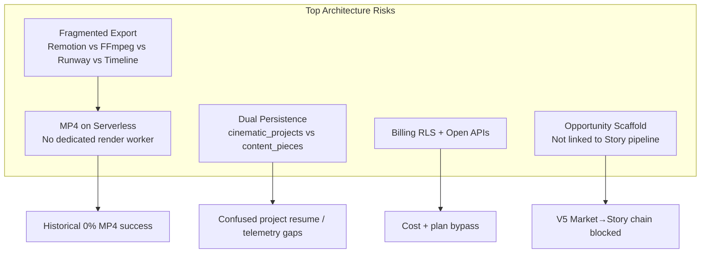

# Mugtee AI Studio — Full QA Audit (12 Phases)

**Date:** 2026-06-03  
**Auditor roles:** Senior QA Engineer, Product Tester, AI Systems Auditor, Performance Engineer  
**Repo:** `Mugtee-AI-Studio`  
**Production:** https://mugtee.in  
**Method:** Code + docs audit (primary); selective live HTTP checks (secondary)  
**References:** [current-architecture.md](./current-architecture.md), [EXPORT_AUDIT.md](./EXPORT_AUDIT.md), [SITE_UX_AUDIT.md](./SITE_UX_AUDIT.md), [MP4_EXPORT_TRACKING.md](./MP4_EXPORT_TRACKING.md), [AI_PROVIDER_MIGRATION.md](./AI_PROVIDER_MIGRATION.md)

---

## Scoring Rubric (0–100)

| Band | Meaning |
|------|---------|
| **90–100** | Production-ready; minor polish only |
| **75–89** | Solid core; known gaps with workarounds |
| **60–74** | Functional but material reliability or UX risk |
| **40–59** | Major blockers or partial implementation |
| **Below 40** | Critical failure or security exposure |

Scores are **evidence-weighted**: code paths and existing audits carry primary weight; live checks adjust where they contradict stale docs. Each finding is labeled **code-inferred** or **live-tested**.

---

## Executive Summary

| Dimension | Score | Label | Basis |
|-----------|------:|-------|-------|
| **Overall Product Readiness** | **58** | YELLOW | Strong generation pipeline; export reliability and security gaps block confident launch |
| **Auth & Session** | **72** | YELLOW | Google OAuth + SSR session solid; no password reset; API auth inconsistent |
| **Workspace & Persistence** | **68** | YELLOW | `cinematic_projects` autosave works; dual persistence with legacy tables |
| **Opportunity → Story** | **58** | RED | Radar/templates exist; not productized; no opportunity↔project link |
| **AI Models & Routing** | **70** | YELLOW | 5-provider router on hook/script; partial migration; OpenAI untimed |
| **Selective Regeneration** | **76** | YELLOW | Hook/script/scene/thumbnail regen + context preservation implemented |
| **Director Mode** | **74** | YELLOW | Modes, story bible, visual direction, motion rules; API motion director unwired |
| **Image Generation** | **78** | GREEN | Flux → Together → Pollinations chain; OpenAI fallback; Gemini image dead code |
| **Video & Motion** | **52** | RED | Remotion path exists; serverless render risk; scene video (Seedance) separate |
| **Export & Publish** | **55** | RED | Asset exports work; MP4 historically 0% success; poll/timeout edge cases |
| **Performance** | **62** | YELLOW | R3F lazy-loaded; heavy packages externalized; sparse automated tests |
| **Cost Efficiency** | **58** | YELLOW | `alignOutputToBrief` fixed; router retries + hardcoded premium models remain |
| **Security** | **48** | RED | No API rate limiting; billing self-write RLS; unauthenticated paid routes |

**Live-tested snapshot (2026-06-03):**

| Check | Result |
|-------|--------|
| `GET https://mugtee.in` | **200** in ~1.3s (**live-tested**) |
| `GET /api/quick-cut/config` | **200** — `videoRenderEnabled: true`, `remotion: true`, `ffmpeg: false`, `sceneVideoEnabled: true` (**live-tested**) |
| `GET /home`, `/auth/login` | **200** (**live-tested**) — pages reachable; auth wall not verified without session |
| `GET /api/ai/providers/health` | **403** in production (**live-tested**) — expected lockdown |

> **Note:** Prior audits ([EXPORT_AUDIT.md](./EXPORT_AUDIT.md),
> [SITE_UX_AUDIT.md](./SITE_UX_AUDIT.md)) assumed `VIDEO_RENDER_ENABLED`
> was unset on Vercel. **Live config now reports render enabled.** Residual
> MP4 failure mode shifts from config gate → Remotion/serverless reliability,
> asset validation, and poll/timeout bugs (code-inferred).

---

## Phase 1 — Auth

**Score: 72/100** | **Status: YELLOW**

### What works (code-inferred)

- Google OAuth via Supabase SSR: `components/auth/login-content.tsx` → `app/auth/callback/route.ts` (PKCE `exchangeCodeForSession`)
- Session refresh in middleware using `getUser()` (validated JWT): `middleware.ts`, `lib/supabase/middleware.ts`
- Open-redirect hardening: `lib/url.ts` `safeRelative()`, `lib/auth/post-login-redirect.ts`
- Double page guard: `middleware.ts` + `app/(app)/layout.tsx`
- Client hydration gate: `lib/auth/use-auth-hydration.ts` waits for `INITIAL_SESSION`

### Critical / high gaps

| ID | Severity | Finding | Evidence | Label |
|----|----------|---------|----------|-------|
| AUTH-01 | P2 | ~~**No password reset**~~ **Resolved** — `/auth/forgot-password` (email when `NEXT_PUBLIC_SUPABASE_EMAIL_AUTH=true`, else Google-only copy) | `components/auth/forgot-password-content.tsx` | fixed 2026-06-03 |
| AUTH-02 | P2 | ~~**Sign-out redirects to `/signin`**~~ **Resolved** — redirects to `/auth/login` | `app/auth/signout/route.ts` | fixed 2026-06-03 |
| AUTH-03 | P1 | ~~**`/api/*` public at middleware**~~ **Resolved** — narrow public API list + `requireAuth()` on high-cost routes | `lib/auth/public-routes.ts`, `lib/auth/require-auth.ts`, generate-* / render/reel | fixed 2026-06-03 |
| AUTH-04 | P2 | ~~Inconsistent login paths~~ **Resolved** — canonical `/auth/login`; `/login` and `/signin` redirect | `app/login/page.tsx`, `app/signin/page.tsx`, `app/cinematic/layout.tsx` | fixed 2026-06-03 |

---

## Phase 2 — Workspace

**Score: 68/100** | **Status: YELLOW**

### What works (code-inferred)

- **Canonical path:** `useCinematicProjectStore` → `scheduleAutosave` (2200ms debounce) → `lib/cinematic-projects.ts` → `cinematic_projects` with RLS
- **Create / hydrate / delete:** `createProject`, `hydrateProject`, `deleteProject` in store + `lib/cinematic-projects.ts`
- **Generation recovery:** `generation_status`, `generation_step`, `generation_error` (migration `0019`); `resumeGeneration()` in `quick-cut-generation-store.ts`
- **Draft recovery UX:** `lib/last-workspace.ts` (14-day TTL), `lib/cinematic/project-hydration-cache.client.ts` (5 min sessionStorage)
- **Duplicate project:** `duplicateProject()` clones without reel/video

### Dual persistence (architecture risk)

| Store | Table | Entry |
|-------|-------|-------|
| Quick Cut / Studio | `cinematic_projects` | `lib/cinematic-projects.ts` |
| Legacy `/workspace` | `content_pieces` | `app/api/workspace/save`, `workspace-page.tsx` |
| Legacy API | `projects` | `app/api/projects/create` |
| Demo (non-prod) | In-memory | `app/api/projects/Save/route.ts` |

Per [current-architecture.md](./current-architecture.md) §11: no merge layer; same user can have parallel project universes.

### Gaps

| ID | Severity | Finding | Evidence |
|----|----------|---------|----------|
| WS-01 | P1 | Export telemetry logs to `content_pieces` id — may miss Quick Cut `cinematic_projects` ids | `use-unified-export-actions.client.ts` → `/api/workspace/exports` |
| WS-02 | P2 | Migration doc drift — `0049_style_templates.sql` in repo; architecture snapshot listed 0048 as latest | `docs/current-architecture.md` vs `supabase/migrations/0049_*` |
| WS-03 | P2 | Legacy workspace autosave only after first explicit save (2500ms) | `workspace-page.tsx` |

---

## Phase 3 — Opportunity → Story

**Score: 58/100** | **Status: RED**

### Implemented (code-inferred)

| Capability | Path |
|------------|------|
| Template opportunity radar | `lib/agent/opportunity-radar.ts`, `lib/agent/content-opportunity-feed.ts` |
| DB cache | `creator_opportunities` (migration `0043`) |
| API + store | `app/api/agent/opportunities`, `stores/creator-agent-store.ts` |
| UI | `components/agent/opportunity-feed.tsx` |
| Hooks / scripts / storyboards | Quick Cut pipeline, workspace tabs, cinematic screens |
| Story bible | `lib/cinematic/story-bible.ts` → `cinematic_projects.story_bible` |
| Style template discovery (orthogonal) | `lib/templates/style-templates.ts`, `0049_style_templates.sql`, `template-gallery.tsx` |

### Gaps vs V5 vision

| ID | Severity | Finding | Evidence |
|----|----------|---------|----------|
| OPP-01 | P1 | **Opportunity cards don't pass topic to create** — generic Quick Cut link | `opportunity-feed.tsx` → `createEntryHref('quick')` without topic |
| OPP-02 | P1 | **No `opportunity_id` on projects** — story not linked to opportunity records | migrations + `lib/cinematic-projects.ts` field list |
| OPP-03 | P2 | Radar is **heuristic templates**, not market ingestion | `opportunity-radar.ts`; no external feed modules |
| OPP-04 | P2 | Only **decision accept** path prefills topic: `/studio/create?mode=quick&topic=…` | `app/api/decision/accept/route.ts` |

---

## Phase 4 — Models

**Score: 70/100** | **Status: YELLOW**

### Provider inventory (code-inferred)

**Location:** `lib/ai/providers/` — OpenAI, Gemini, Groq, OpenRouter, DeepSeek

| Task | Default chain (when env unset) | Configurable via |
|------|-------------------------------|------------------|
| Hook | gemini → groq → openai → openrouter → deepseek | `AI_PROVIDER_HOOK_*` |
| Script | openai → gemini → groq → openrouter → deepseek | `AI_PROVIDER_SCRIPT_*` |
| Title | gemini → openai → groq | `AI_PROVIDER_TITLE_*` |
| Caption | groq → gemini → openai | `AI_PROVIDER_CAPTION_*` |

**Migrated to router:** `POST /api/generate-title`, `POST /api/generate-script` ([AI_PROVIDER_MIGRATION.md](./AI_PROVIDER_MIGRATION.md))

**Live production models** (`GET /api/quick-cut/config`, **live-tested**): `geminiText: gemini-2.0-flash`, `openaiChat: gpt-4o-mini`

### Model defaults (code-inferred)

| Provider | Default model |
|----------|---------------|
| OpenAI | `OPENAI_MODEL` \|\| `gpt-4o-mini` |
| Gemini | `gemini-2.0-flash` |
| Groq | `llama-3.3-70b-versatile` |
| Script fallback (non-router) | `claude-sonnet-4-20250514` via `anthropic-client.ts` |
| Deep research | `sonar-pro` (Perplexity) when key set |

### Gaps

| ID | Severity | Finding |
|----|----------|---------|
| MDL-01 | P2 | `regenerate-hook`, scenes, rewrite, companion still direct OpenAI — not on router |
| MDL-02 | P2 | Title/caption/visual/storyboard/voice/research chains defined but no `executeWithFallback` callers |
| MDL-03 | P2 | Health endpoint **403 in prod** (live-tested) — cannot live-benchmark providers without admin/dev access |

---

## Phase 5 — Selective Regeneration

**Score: 76/100** | **Status: YELLOW**

### Implemented (code-inferred)

| Asset | Mechanism | Path |
|-------|-----------|------|
| Hook | `POST /api/regenerate-hook` | `regenerateHook()` in `quick-cut-generation-store.ts` |
| Script | `POST /api/generate-script` + `regenFresh: true` | `regenerateScript()` |
| Scene image | `POST /api/generate-images` (targeted ids) | `regenerateSceneImage()` |
| Scene copy | `POST /api/regenerate-scene` | Cinematic `scenes-screen.tsx` |
| Thumbnail | Client compose | `regenerateThumbnailImage()` |
| Voice | `POST /api/regenerate-voice` | refinement-client |

### Context preservation (code-inferred)

- `regenFresh` + `preserved` snapshot keeps `storyBible`, `niche`, `styleTemplateId`, voice ids, `previousHook`/`previousScript` (`quick-cut-generation-store.ts` ~2219–2341)
- `buildQuickCutRegenPayload` / `buildRegenPayload` in `lib/cinematic/refinement-client.ts`
- `variationHistory` + version rollback: `lib/cinematic/variation-history.ts`, `variation-history-panel.tsx`
- `alignOutputToBrief` — keyword drift check, **no extra LLM** (`lib/content-director/align-output.ts`)

### Gaps

| ID     | Severity | Finding                                           |
| ------ | -------- | ------------------------------------------------- |
| REG-01 | P2       | Hook regen hardcodes gpt-4o-mini, skips AI router |
| REG-02 | P3       | No regenerate-script API; reuses generate-script  |

---

## Phase 6 — Director Mode

**Score: 74/100** | **Status: YELLOW**

### Implemented (code-inferred)

| Feature | Path |
|---------|------|
| 4 director presets + localStorage | `lib/cinematic/director-modes.ts`, `director-mode-selector.tsx` |
| Prompt injection | `lib/ai/prompts/cinematic/director-mode-prompt.ts` |
| Visual direction step | `lib/cinematic/visual-direction.ts`; pipeline step in `quick-cut-generation-store.ts` |
| Story bible build | `buildStoryBibleFromVisualDirection` in `story-bible.ts` |
| Visual bible (V3) | `lib/cinematic/visual-bible.ts` |
| Motion (rules-first) | `lib/motion/motion-director-rules.ts`, `assignSceneMotion()` in `motion-presets.ts` |
| Remotion motion mapping | `lib/motion/apply-scene-motion.ts` |
| Content / creative director briefs | `lib/content-director/content-brief.ts`, `creative-director-brief.ts` |

### Gaps

| ID | Severity | Finding |
|----|----------|---------|
| DIR-01 | P2 | `/api/ai/motion-director` exists but Quick Cut uses local rules only — OpenAI refine unused |
| DIR-02 | P3 | Cinematic compile screen `prepare` route returns metadata only — not final MP4 |

---

## Phase 7 — Image Generation

**Score: 78/100** | **Status: GREEN**

### Provider chain (code-inferred)

**Primary:** `lib/image-providers/index.ts`

```
FluxAPI Kontext → Together FLUX.1-schnell → Pollinations (keyless URL)
```

| Provider | File | Env |
|----------|------|-----|
| Flux | `fluxapi.ts` | `FLUXAPI_KEY` / `FLUX_API_KEY` |
| Together | `together.ts` | `TOGETHER_API_KEY` |
| Pollinations | `pollinations.ts` | None |

**Secondary fallback (outside `lib/image-providers`):**

- OpenAI Images (`gpt-image-1` default): `lib/ai/generate-scene-image.ts` — used when Flux chain fails and `allowDalleImages()`
- Gemini image: `lib/ai/gemini-image.ts` — **implemented but no callers** in scene/storyboard pipelines

**Entry routes:** `POST /api/generate-images`, `POST /api/ai/image`

**Live-tested:** `images: true` on `/api/quick-cut/config`

### Gaps

| ID     | Severity | Finding                                        |
| ------ | -------- | ---------------------------------------------- |
| IMG-01 | P2       | Gemini image code is dead; maintenance surface |
| IMG-02 | P3       | Pollinations fallback; quality varies in prod  |

---

## Phase 8 — Video

**Score: 52/100** | **Status: RED**

### Architecture (code-inferred)

| Layer | Technology | Path |
|-------|------------|------|
| **Final reel MP4** | Remotion h264 1080×1920 | `orchestrate-remotion-reel.ts` → `render-reel.server.ts` |
| **Per-scene AI clip** | Seedance (factory default) | `lib/video-providers/seedance-*`, `/api/generate-scene-video` |
| **Runway clips** | Separate subsystem | `lib/ai/runway-video.ts`, `/api/ai/runway-video` |
| **Legacy faceless** | FFmpeg + Runway | `/api/render-video` — no `waitUntil` on Vercel |

**Live-tested:** `remotion: true`, `ffmpeg: false`, `videoProvider: "remotion"`, `seedance: true`, `sceneVideoEnabled: true`

### Gaps

| ID | Severity | Finding |
|----|----------|---------|
| VID-01 | P0 | **Remotion on Vercel serverless** — Chromium + bundle under 300s `maxDuration`; OOM/timeout risk ([EXPORT_AUDIT.md](./EXPORT_AUDIT.md)) |
| VID-02 | P1 | No dedicated render worker — all export on serverless |
| VID-03 | P1 | Runway not in scene-video factory — two parallel video subsystems |
| VID-04 | P2 | `ffmpeg: false` on prod — legacy FFmpeg paths unavailable |

---

## Phase 9 — Export

**Score: 55/100** | **Status: RED**

### Asset exports — working (code-inferred + [SITE_UX_AUDIT.md](./SITE_UX_AUDIT.md))

| Format | Implementation |
|--------|----------------|
| Script TXT/DOCX | `download-script.ts`, `export-docx.ts` |
| Storyboard JPG ZIP | `download-scene-image.ts` |
| Storyboard JSON | `download-storyboard-package.ts` |
| Storyboard PDF | Browser `window.print()` only — `storyboard-panel.tsx` |
| Narration MP3 | `download-audio.ts` |
| Creator Pack / Platform ZIP | `creator-pack-export.client.ts`, `platform-pack-export.client.ts` |
| MP4 | Remotion queue — see below |

### MP4 pipeline (code-inferred)

```
Client compile → POST /api/reels/export → waitUntil → orchestrateRemotionReel
→ upload reels bucket → poll GET /api/reels/export/[jobId] → download /file
```

**Tracking:** `mp4_*` events in `analytics_events`; view `mp4_export_failures` (migration `0048`); admin `/admin/export-funnel`

**Historical production metric:** ~25 users, **0 successful MP4 exports** ([EXPORT_AUDIT.md](./EXPORT_AUDIT.md), [SITE_UX_AUDIT.md](./SITE_UX_AUDIT.md)) — **code-inferred from prior ops context**

**Live update:** `videoRenderEnabled: true` — config gate may no longer be primary blocker; Remotion reliability remains.

### Critical export bugs

| ID | Severity | Finding | Evidence |
|----|----------|---------|----------|
| EXP-01 | P0 | **0% MP4 completion historically** — core publish artifact broken for users | EXPORT_AUDIT, SITE_UX_AUDIT |
| EXP-02 | P0 | **No durable `export_jobs` table** — in-memory + project row only; cold starts lose jobs | `lib/video/job-store.ts` |
| EXP-03 | P1 | `mapProjectReelStatus`: `reel_status=completed` without valid `reel_url` → client stuck on **`uploading`** | `lib/reels/export-api.ts` |
| EXP-04 | P1 | Asset HEAD validation can 400 before render (expired signed URLs) | `lib/export/asset-validation.server.ts` |
| EXP-05 | P1 | `waitUntil` / 300s timeout — render may not finish on serverless | `export-background.server.ts` |
| EXP-06 | P2 | Progress UI can show 0% on failed states | `export-stages.ts`, `export-poll.client.ts` |
| EXP-07 | P2 | `/api/render-video` async without `waitUntil` — unreliable on Vercel | EXPORT_AUDIT §8 |

---

## Phase 10 — Performance

**Score: 62/100** | **Status: YELLOW**

### Bundle & lazy loading (code-inferred)

| Pattern | Examples |
|---------|----------|
| `next/dynamic` + `ssr: false` | `mugtee-avatar.tsx`, `mugtee-sidekick-avatar.tsx`, `quick-cut-studio.tsx`, landing sections |
| `React.lazy` | `output-workspace-panel.tsx` (CaptionSection, ThumbnailSection) |
| WebGL fallback | `shouldPrefer2DFallback()` in `mugtee-avatar.tsx` |
| Heavy packages externalized | `next.config.js`: `@remotion/renderer`, `@remotion/bundler`, `ffmpeg-static`, `mongodb` |
| Package import optimization | `optimizePackageImports: ['framer-motion']` |

**Not live-tested:** No bundle analyzer run in this audit; no Lighthouse scores captured.

### Timeout classification (code-inferred)

| Component | Timeout | Class |
|-----------|---------|-------|
| Hook/title/caption (router) | 15s | GREEN |
| Script/storyboard/research (router) | 60s | YELLOW |
| Visual/voice (router default) | 30s | GREEN |
| **OpenAI provider (SDK)** | **None** | **RED** |
| Client script generation | 180s | YELLOW |
| Deep research | 55s | YELLOW |
| Export poll fetch | 15s | GREEN |
| Reel export client max | 15 min | YELLOW |
| API route `maxDuration` (export, script, images) | 300s | YELLOW (Vercel ceiling) |
| Asset URL verification | 12s | GREEN |

### Test coverage (code-inferred)

- **4** unit/e2e files: intent extraction, scene-image prompt, narrative frameworks, `e2e/example.spec.ts` stub
- No CI performance regression gates found

| ID | Severity | Finding |
|----|----------|---------|
| PERF-01 | P1 | OpenAI SDK calls have no AbortSignal timeout — hung requests consume function time |
| PERF-02 | P2 | Sparse automated test suite for 145+ API routes |
| PERF-03 | P2 | R3F/Three.js still loaded on companion/sidekick routes — mitigated by dynamic import + 2D fallback |

---

## Phase 11 — Cost

**Score: 58/100** | **Status: YELLOW**

### Optimizations confirmed (code-inferred)

- **`alignOutputToBrief`** — keyword-only drift check, no extra LLM (`align-output.ts` L38–40) ✅ fixed
- Router respects `FREE_TIER_ONLY` and cheap defaults (`gpt-4o-mini`, `gemini-2.0-flash`, Groq Llama)

### Cost risks (code-inferred)

| ID | Risk | Impact | Evidence |
|----|------|--------|----------|
| COST-01 | Router **3× retry per provider** × up to 5 providers | High on failures | `router.ts` `MAX_RETRIES_PER_PROVIDER = 2` |
| COST-02 | SOP script regen loop (1–2 retries) | Medium | `run-script-generation.ts`, `script-sop.ts` |
| COST-03 | **`gpt-4.1-mini` hardcoded** on rewrite/motion/generate routes | Higher than routed `gpt-4o-mini` | `app/api/ai/rewrite`, `generate`, `motion-director` |
| COST-04 | Claude Sonnet script fallback | High per failure | `anthropic-client.ts` |
| COST-05 | Perplexity `sonar-pro` on deep research | High when enabled | `perplexity-client.ts` |
| COST-06 | **Unauthenticated API abuse** — no rate limit on paid routes | Unbounded spend | See SEC-01 |
| COST-07 | `regenerate-hook` direct OpenAI, not router cost routing | Medium | `regen-openai.ts` |

---

## Phase 12 — Security

**Score: 48/100** | **Status: RED**

### Strengths (code-inferred)

- Server AI keys not in `NEXT_PUBLIC_*` (`.env.example`)
- RLS enabled on `cinematic_projects`, creator tables, most user data
- Supabase anon key in client is expected pattern with RLS
- Security headers in `next.config.js`: `X-Frame-Options`, `X-Content-Type-Options`
- MP4 export requires auth: `requireCinematicUser()` in `app/api/reels/export/route.ts`

### Critical / high gaps

| ID | Severity | Finding | Evidence |
|----|----------|---------|----------|
| SEC-01 | **P0** | **No centralized API rate limiting** — IP/user throttling absent | Grep: no `@upstash/ratelimit` or equivalent |
| SEC-02 | **P0** | **Unauthenticated paid generation routes** — middleware skips `/api/*` | `generate-images`, `generate-scenes`, `generate-title`, `render/reel`, `ai/runway-video`, `guest-hook`, etc. |
| SEC-03 | **P0** | **`profiles.plan_type` self-writable** — user can set `PRO` via direct Supabase client | `0010_profile_trial.sql` policies; `isUnlimitedPlan('PRO')` |
| SEC-04 | **P1** | **`subscriptions` self insert/update** including `status: active` | `migrations/0001_billing.sql` (outside `supabase/migrations/`) |
| SEC-05 | P1 | Open analytics/revenue insert — spam/DoS on `analytics_events` | `0013_analytics_events.sql` |
| SEC-06 | P1 | `/api/test-db` unauthenticated schema probe | `app/api/test-db/route.ts` |
| SEC-07 | P1 | Public storage buckets — reels/project-assets readable if URL known | `0022_reel_render.sql`, `0011_project_assets.sql` |
| SEC-08 | P2 | Guest hook limit client-only (localStorage) | `guest-hook-generator.tsx` |
| SEC-09 | P2 | Legacy Mongo catch-all API with `CORS_ORIGINS=*` default | `app/api/[[...path]]/route.js` |
| SEC-10 | P2 | Billing/YouTube RLS in separate `migrations/` folder — deployment drift risk | Not in `supabase/migrations/` |

---

## Critical Bugs (P0 / P1)

### P0 — Fix before any paid launch

| # | ID | Bug | Phase | Label |
|---|-----|-----|-------|-------|
| 1 | **EXP-01** | **0% historical MP4 export success** — core product promise unmet for ~25 users | Export | code-inferred (ops) + live config now enabled |
| 2 | **SEC-01** | **No API rate limiting** — abuse vector for cost and availability | Security | code-inferred |
| 3 | **SEC-02** | **Unauthenticated access to expensive generation/render APIs** | Security | code-inferred |
| 4 | **SEC-03** | **Client-writable `plan_type` / unlimited plan bypass** | Security | code-inferred |
| 5 | **EXP-02** | **No durable export job queue** — jobs lost on cold start; unreliable poll UX | Export | code-inferred |
| 6 | **VID-01** | **Remotion on Vercel serverless** — likely root cause of render failures even with env enabled | Video | code-inferred |

### P1 — Fix before scaling past ~100 users

| # | ID | Bug | Phase |
|---|-----|-----|-------|
| 7 | EXP-03 | Poll stuck on `uploading` when DB status completed but no `reel_url` | Export |
| 8 | EXP-04 | Expired signed asset URLs block export validation | Export |
| 9 | EXP-05 | `waitUntil` + 300s ceiling insufficient for Remotion renders | Export |
| 10 | OPP-01 | Opportunity radar doesn't hand off topic to create flow | Opportunity |
| 11 | OPP-02 | No opportunity↔project linkage in schema | Opportunity |
| 12 | WS-01 | Export telemetry may not attach to cinematic project ids | Workspace |
| 13 | SEC-04 | Subscriptions self-write bypasses Razorpay verification | Security |
| 14 | SEC-05 | Unbounded analytics event ingestion | Security |
| 15 | SEC-06 | `/api/test-db` exposed in production | Security |
| 16 | AUTH-03 | API routes rely on per-route auth — many gaps | Auth |
| 17 | PERF-01 | OpenAI provider has no fetch timeout | Performance |

---

## High Priority (P2)

| ID | Item | Phase |
|----|------|-------|
| AUTH-01 | Implement password reset or document Google-only recovery | Auth |
| AUTH-02 | Fix sign-out redirect (`/signin` → `/auth/login`) | Auth |
| REG-01 | Migrate `regenerate-hook` to AI router | Regen |
| MDL-01 | Complete AI provider migration for remaining routes | Models |
| COST-03 | Replace `gpt-4.1-mini` hardcodes with env-driven models | Cost |
| IMG-01 | Wire or remove dead Gemini image path | Image |
| DIR-01 | Wire motion-director API or remove dead endpoint | Director |
| WS-02 | Apply migration 0049; reconcile doc drift | Workspace |
| EXP-06 | Fix failed-state progress UX (0% spinner) | Export |
| EXP-07 | Add `waitUntil` to legacy `/api/render-video` or deprecate | Export |
| SEC-07 | Review public bucket policies for reels/assets | Security |
| SEC-08 | Server-side guest hook rate limit | Security |
| PERF-02 | Expand API/integration test coverage | Performance |

---

## AI Quality Findings

| Area | Assessment | Evidence |
|------|------------|----------|
| **Hook generation** | Good — multi-provider router + Virlo rules + validation retry | `generation-bridge.ts`, `generate-title/route.ts` |
| **Script generation** | Good — SOP scoring, memory/brief injection, Claude fallback | `run-script-generation.ts`, `context-injection.ts` |
| **Context injection** | Strong — intent, memory, niche lock, content brief on router calls | `lib/ai/providers/context-injection.ts` |
| **Output alignment** | Lightweight — keyword `alignOutputToBrief` prevents silent drift without cost | `align-output.ts` |
| **Opportunity quality** | Weak — template heuristics, not market-backed; scores not validated | `opportunity-radar.ts` |
| **Visual continuity** | Good — story bible + style templates + visual direction step | `story-bible.ts`, `style-templates.ts` |
| **Image quality** | Variable — Flux/Together good; Pollinations fallback inconsistent | `image-providers/index.ts` |
| **Voice** | Good when ElevenLabs configured — live: `elevenlabs: true` | `/api/quick-cut/config` |
| **Partial regen quality** | Good — `regenFresh`, previous hook/script, variation history preserve intent | `quick-cut-generation-store.ts` |
| **Quality gates** | Partial — hook validation in router; script SOP retries; no shipped A/B pack | AI_PROVIDER_MIGRATION.md future items |

**AI Quality composite: 65/100** (strong generation stack; weak opportunity/market intelligence layer)

---

## Cost Optimization Findings

| Priority | Action | Est. impact |
|----------|--------|-------------|
| **P0** | Require auth + rate limit on all provider-cost routes | Prevents unbounded abuse spend |
| **P0** | Lock `profiles.plan_type` and `subscriptions` to service-role writes | Prevents free unlimited usage |
| **P1** | Unify on AI router; remove `gpt-4.1-mini` hardcodes in rewrite/motion/generate | Align cost with `gpt-4o-mini` defaults |
| **P1** | Reduce router retry budget on non-critical tasks (caption vs script) | Lower cascade cost on provider outages |
| **P2** | Task-aware routing (Phase 3 in migration doc) — cheap models for captions | Documented but not implemented |
| **P2** | Cache provider health cooldown aggressively | `health.ts` exists — tune thresholds |
| **P2** | Wire Gemini image or delete — avoid duplicate maintenance | Dead code cost |
| **Done** | `alignOutputToBrief` — no duplicate LLM call | Already fixed |

---

## Architecture Risks



| Risk | Severity | Description |
|------|----------|-------------|
| Dual persistence | HIGH | Three project stores (`cinematic_projects`, `content_pieces`, `projects`) + in-memory demo API |
| MP4 on serverless | CRITICAL | Remotion + Chromium under 300s without worker queue |
| Fragmented video | HIGH | Seedance scene clips, Runway, Remotion reel, FFmpeg faceless — no single blessed path documented in UI |
| Open API surface | CRITICAL | Middleware public `/api/*` + missing auth on paid routes |
| Billing trust model | CRITICAL | Client-writable plan fields undermine usage guards |
| Opportunity not productized | MEDIUM | V5 vision blocked at Market→Story entry |
| Migration drift | MEDIUM | Billing/YouTube RLS outside `supabase/migrations/`; 0049 not in architecture snapshot |
| Observability | LOW-MEDIUM | MP4 funnel exists (0048) but depends on migration applied + admin access |
| Legacy Mongo API | LOW | Catch-all route if `MONGO_URL` set |

**Architecture readiness (V5 evolution): 65/100** — aligns with [current-architecture.md](./current-architecture.md) §12 (68/100) adjusted down for live security findings.

---

## Final Recommendation

### At 100 users (closed beta)

**Do not launch paid tiers until:**

1. Fix **SEC-02, SEC-03, SEC-01** (auth on paid routes, RLS billing lock, rate limits)
2. Prove **≥1 successful end-to-end MP4** on production with logging (`mp4_completed` event)
3. Apply migrations **0048** (funnel) and **0049** (style templates) in Supabase
4. Fix **EXP-03** poll stuck state and **AUTH-02** sign-out redirect

**Acceptable for free beta:** Asset exports, in-browser preview, generation pipeline, companion shell.

### At 1,000 users

**Required before scale:**

1. **Dedicated render worker** (Remotion Lambda, Fly.io, or similar) — exit pure Vercel serverless for MP4
2. Durable **`export_jobs`** table with heartbeat and error codes
3. Complete **AI provider migration** (Phase 2 per migration doc)
4. Unify persistence — deprecate `content_pieces` write path or sync layer
5. Server-side rate limiting + WAF rules on `/api/generate-*`, `/api/reels/export`
6. Expand test suite — at minimum export queue, auth guards, regen context contract tests

### At 10,000 users

**Required:**

1. Full **Opportunity Engine** with market signals and `opportunity_id` on projects
2. Task-aware **cost routing** and provider cost dashboard
3. CDN-stable public asset URLs before export validation
4. Remove legacy paths (`/api/render-video` without waitUntil, in-memory `projects/Save`, Mongo catch-all)
5. SOC2-adjacent controls: audit log for plan changes, service-role-only billing writes, secret rotation runbook
6. Performance budget CI (bundle size, LCP on `/studio/create`, R3F load metrics)

### Launch verdict

| Scale | Verdict |
|-------|---------|
| **100 users** | **Conditional no-go for paid launch** — security P0s and MP4 unproven. OK for invite-only free beta with asset export only. |
| **1,000 users** | **No-go** until render worker + billing RLS + rate limits shipped. |
| **10,000 users** | **No-go** until V5 opportunity chain, cost controls, and legacy deprecation complete. |

---

## Appendix A — Phase Score Summary

| Phase | Name | Score | Status |
|------:|------|------:|--------|
| 1 | Auth | 72 | YELLOW |
| 2 | Workspace | 68 | YELLOW |
| 3 | Opportunity → Story | 58 | RED |
| 4 | Models | 70 | YELLOW |
| 5 | Selective Regen | 76 | YELLOW |
| 6 | Director Mode | 74 | YELLOW |
| 7 | Image | 78 | GREEN |
| 8 | Video | 52 | RED |
| 9 | Export | 55 | RED |
| 10 | Performance | 62 | YELLOW |
| 11 | Cost | 58 | YELLOW |
| 12 | Security | 48 | RED |

## Appendix B — Live vs Code-Inferred Coverage

| Area | Live-tested | Code-inferred only |
|------|-------------|-------------------|
| Site availability | ✅ mugtee.in 200 | — |
| Quick Cut config flags | ✅ full JSON | — |
| MP4 compile success | ❌ | ✅ pipeline trace + ops metric |
| Auth session flows | ❌ | ✅ OAuth/callback code |
| Generation quality | ❌ | ✅ prompt/router architecture |
| Provider health | ✅ 403 (locked) | ✅ health route code |
| RLS exploitability | ❌ | ✅ policy review |
| Bundle size / LCP | ❌ | ✅ lazy-load patterns |

## Appendix C — Key Files Index

| Domain | Files |
|--------|-------|
| Auth | `middleware.ts`, `app/auth/callback/route.ts`, `lib/auth/public-routes.ts` |
| Workspace | `stores/cinematic-project.ts`, `lib/cinematic-projects.ts` |
| Opportunity | `lib/agent/opportunity-radar.ts`, `components/agent/opportunity-feed.tsx` |
| AI Router | `lib/ai/providers/router.ts`, `task-routing.ts` |
| Regen | `stores/quick-cut-generation-store.ts`, `app/api/regenerate-hook/route.ts` |
| Director | `lib/cinematic/director-modes.ts`, `lib/cinematic/story-bible.ts` |
| Images | `lib/image-providers/index.ts`, `lib/cinematic/generate-scene-images.ts` |
| Video | `lib/video/orchestrate-remotion-reel.ts`, `lib/video-providers/factory.ts` |
| Export | `lib/reels/export-api.ts`, `lib/quick-cut/compile-project-mp4.client.ts` |
| Security | `supabase/migrations/0010_profile_trial.sql`, `lib/usage/api-guards.ts` |
| Analytics | `lib/analytics/mp4-export-events.ts`, `0048_mp4_export_funnel.sql` |

---

*Audit completed 2026-06-03. Documentation only — no code changes in this pass.*
