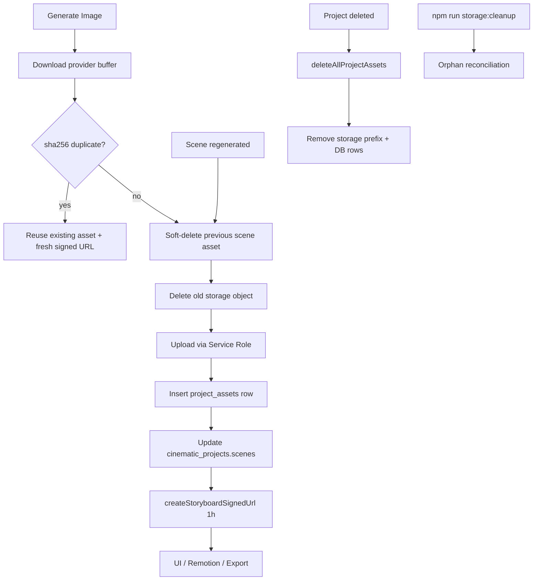

# Storage Asset Management Architecture

Supabase Storage is the **single source of truth** for storyboard images.

The database stores durable references only (`bucket`, `storage_path`, `sha256`).
Signed URLs are generated at read time (1-hour TTL).

## Pipeline



## Table: `project_assets` (durable fields)

| Column | Purpose |
| --- | --- |
| `id` | Scene linkage via `imageAssetId` |
| `project_id` | Project scope |
| `scene_id` | One active image per scene |
| `storage_path` | Object key in bucket |
| `bucket` | Always `project-assets` for storyboards |
| `sha256` | Duplicate detection |
| `file_size` | Audit / quota |
| `deleted_at` | Soft-delete before storage removal |
| `last_verified_at` | Integrity checks |
| `url` | **NULL** — never persist signed URLs |

## Scene JSON fields

| Field | Persisted | Notes |
| --- | --- | --- |
| `imageAssetId` | Yes | FK to `project_assets.id` |
| `imageAssetPath` | Yes | Storage object path |
| `imageUrl` | Session only | Fresh signed URL at generation/load |
| `thumbnailUrl` | Session only | Same as imageUrl for display |

## CLI commands

| Command | Purpose |
| --- | --- |
| `npm run storage:audit` | Report orphans, duplicates, usage |
| `npm run storage:cleanup` | Delete orphan objects + stale DB rows |
| `npm run storage:recover` | Audit + cleanup + soft-deleted + duplicates |

## Safety

1. Verify `user_id` + `project_id` + `storage_path` prefix before delete
2. Soft-delete DB row first
3. Delete storage object second
4. Rollback soft-delete if storage delete fails

## Modified files

See git diff. Key modules under `lib/storage/`.

## Audit reports

Run with `SUPABASE_SERVICE_ROLE_KEY` set:

```bash
npm run storage:audit    # → docs/STORAGE_AUDIT_REPORT.json
npm run storage:recover  # → docs/STORAGE_RECOVER_REPORT.json
```

**Before cleanup:** Run `storage:audit` to capture baseline orphans and
potential savings.

**After cleanup:** Re-run `storage:audit` — expect `orphans: 0` and
`missingFiles: 0`.

## Verification

```typescript
import { verifyStorageIntegrity } from '@/lib/storage/verify-integrity.server'

const report = await verifyStorageIntegrity({ projectId, userId, scenes })
// All scenes: storageExists, dbExists, http200, thumbnailWorks === true
```

## Migration

Apply `supabase/migrations/0069_project_assets_storage_management.sql`
via Supabase SQL editor or CLI.
