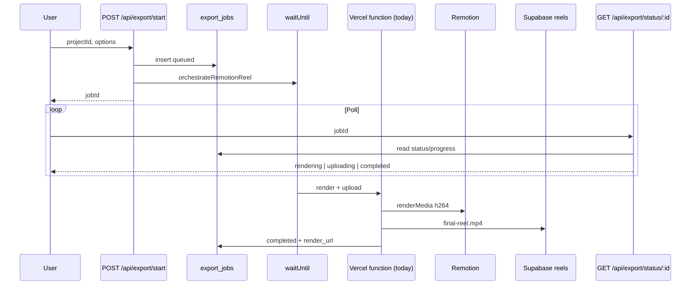

# Export Architecture v2

**Date:** 2026-06-03

---

## Flow



---

## States

| `export_jobs.status` | Client label |
|----------------------|--------------|
| `pending` | Preparing |
| `queued` | Queued |
| `rendering` | Encoding |
| `uploading` | Uploading |
| `completed` | Download ready |
| `failed` | Failed |
| `cancelled` | Cancelled |

Progress: `0–100` in `export_jobs.progress`. Stage detail in `metadata.stage` / `metadata.label`.

---

## Data Model

```sql
export_jobs (
  id text PK,           -- same as reel-{uuid}-{ts}
  user_id uuid,
  project_id uuid,
  status text,
  progress int,
  render_url text,      -- public URL at completion only
  error text,
  metadata jsonb,       -- storagePath, storageBucket, jobType, heartbeatAt
  created_at, updated_at
)
```

**Rule:** Never store signed URLs in `render_url` or `metadata`. Store `storagePath` + `storageBucket`; sign at download if needed.

---

## API Surface

| Method | Route | Role |
|--------|-------|------|
| POST | `/api/export/start` | Start or resume active job |
| GET | `/api/export/status/[jobId]` | Poll durable status |
| GET | `/api/export/active?projectId=` | Refresh recovery |
| POST | `/api/reels/export` | Legacy (unchanged behavior) |
| GET | `/api/reels/export/[jobId]` | Legacy poll (reads `export_jobs` first) |

---

## Queue Operations (stubs)

| Function | Location | Status |
|----------|----------|--------|
| `enqueue` | `export-job-service` | Implemented |
| `dequeue` | `render-queue` | Stub — needs service-role worker |
| `retry` | `export-job-service` | Stub — resets row; caller re-runs orchestrate |
| `cancel` | `export-job-service` | Stub — marks cancelled |

---

## Migration Path

1. Deploy `0051_export_jobs.sql`
2. New exports write `export_jobs` (done in code)
3. Poll prefers `export_jobs` (done)
4. Deprecate `reel_status` as status source (mirror only)
5. External worker claims `queued` rows (future)
