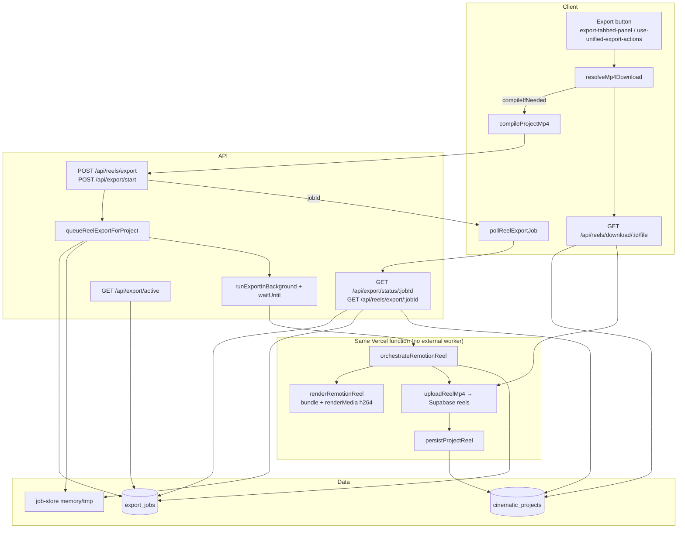
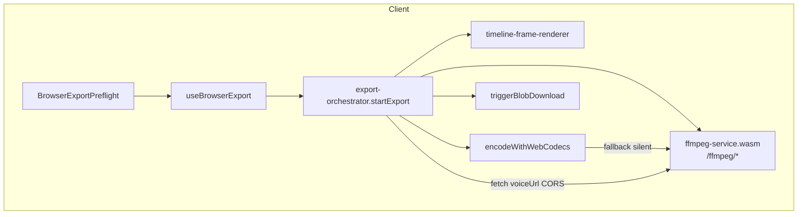

# Export Pipeline Failure Map

**Date:** 2026-06-04  
**Scope:** Quick Cut MP4 export — Server Remotion path (`export_jobs` / dbb0faf) + Browser FFmpeg/WebCodecs path (07767c0)  
**Production context:** ~0% MP4 success reported (see `docs/EXPORT_AUDIT.md`)

---

## End-to-end flow diagrams

### Path A — Server Remotion (primary: “Compile MP4” / “Download MP4”)

### Path B — Browser FFmpeg / WebCodecs (secondary: “Export MP4 in browser”)

**Note:** Browser path does not touch `export_jobs`, API routes, Supabase Storage, or server Remotion. It is a parallel local-only escape hatch shown below the primary server compile UI in `export-tabbed-panel.tsx`.

---

## Failure Map

| Stage | File / Route | Failure mode | Silent? | Logged? | Retries? | User sees? |
|-------|--------------|--------------|---------|---------|----------|------------|
| **UI gate** | `video-render-enabled.ts`, `GET /api/quick-cut/config` | `VIDEO_RENDER_ENABLED` false in prod → 503 | N | Y (`mp4_failed` VIDEO_RENDER_DISABLED) | N | Y (503 message / disabled notice) |
| **Export click** | `export-tabbed-panel.tsx`, `use-unified-export-actions.client.ts` | Usage limit / button disabled | N | Partial (`export_clicked`) | N | Y |
| **Usage guard** | `app/api/reels/export/route.ts` | `guardUsageLimit('renders')` | N | N | N | Y (429-style block) |
| **Validation** | `export-api.ts`, `asset-validation.server.ts` | Missing scenes/images/voice; HEAD on expired signed URLs | N | Y (`mp4_failed` validation) | Asset HEAD: 3× backoff | Y (400) |
| **Queue insert** | `export-job-service.ts` `createExportJob` | DB insert fails (migration 0051 not applied, RLS) | **Y** | console.error only | N | N — job still queued in memory |
| **Queue insert ignored** | `export-api.ts` `queueReelExportForProject` | Return value of `enqueueExportJob` not checked | **Y** | N | N | N |
| **Background dispatch** | `export-background.server.ts` | `waitUntil` unavailable locally; task fire-and-forget | Partial | console.error on throw | N | N until poll fails |
| **Serverless timeout** | Vercel `maxDuration: 300` | Remotion render exceeds 300s; function killed mid-render | Partial | exportLog + orchestrator catch | N | Poll timeout / stuck rendering |
| **Cold start** | `job-store.ts` | In-memory job lost; poll 404 | N | exportLog poll | Poll client: fetch retries + DB recovery | “Export job expired” after recovery fails |
| **Poll drift** | `exportJobToPollResponse` | `status=completed` but invalid `render_url` → forced back to `rendering`/`uploading` | **Y** | debug poll only | N | Spinner until 15m timeout |
| **Project row drift** | `mapProjectReelStatus` | `reel_status=completed` without valid `reel_url` → `uploading` | **Y** | N | DB recovery every 5 polls | Stuck “uploading” |
| **Remotion bundle** | `render-reel.server.ts` `getServeUrl()` | Bundle OOM / missing NFT files on Vercel | N | exportLog + `mp4_failed` REMOTION_BUNDLE_FAILED | N | Y (friendly error) |
| **Asset download** | `render-reel.server.ts` | Scene image/voice download fails | N | throw with scene # | N | Y |
| **Remotion render** | `renderMedia` h264 | Chromium OOM, encode failure | N | exportLog + `mp4_failed` | N | Y |
| **Storage upload** | `reel-storage-upload.ts` | `reels` bucket error; fallback `project-assets` | N | exportLog | Upload: 3× backoff | Y if both fail |
| **Persist project** | `persistProjectReel` | DB update fails after upload | N | logError | N | Poll may never show URL |
| **Thumbnail** | `orchestrate-remotion-reel.ts` | Thumb upload fails | **Y** | N | N | N (optional asset) |
| **Async catch (outer)** | `export-api.ts` background `.catch` | Updates job + project to failed | N | `mp4_failed` + exportLog | N | Y on poll |
| **Sync catch (inner)** | `orchestrate-remotion-reel.ts` | Re-throws after state sync | N | `mp4_failed` | N | Y |
| **Poll client** | `export-poll.client.ts` | 15m hard timeout | N | N | Fetch: 3×; DB recovery | Y (timeout message) |
| **Poll client** | `export-poll.client.ts` | 404 with no DB recovery | N | N | DB recovery once | Y |
| **Download** | `resolve-mp4-download.client.ts` | Empty blob, expired URL | N | `recordDownloadFailure` → `mp4_failed` | Re-compile if eligible | Y (toast) |
| **Download API** | `app/api/reels/download/.../file` | Storage fetch fail | N | exportLog.error | verify + storage fallback | Y (502 JSON) |
| **Generation poll** | `quick-cut-generation-store.ts` `resumeRenderPoll` | Poll/render failure | **Y** (analytics) | N | Same as poll client | Y (`renderError`) |
| **Generation render** | `retryVideoRender` | API failure without going through resolveMp4Download | **Y** (analytics) | N | Manual retry | Y |
| **Creator Pack ZIP** | `creator-pack-export.client.ts` | `fetchMp4Bytes` null / catch | **Y** | N | compile inside fetchMp4Bytes | ZIP succeeds; MP4 warning in metadata only |
| **Platform ZIP** | `platform-pack-export.client.ts` | Same as Creator Pack | **Y** | N | Same | Same |
| **fetchMp4Bytes** | `fetch-mp4-bytes.client.ts` | Returns `null` on all paths fail | **Y** | N | compile retry inside | N (caller adds warning) |
| **Browser preflight** | `export-capabilities.ts` | WASM/Worker/COI blockers | N | N | N | Y (blockers list) |
| **FFmpeg load** | `ffmpeg-service.ts` | `/ffmpeg/*` 404 or WASM load fail | N | logBuffer | N | Y (throws to UI) |
| **WebCodecs encode** | `export-orchestrator.ts` | H.264 unsupported | Partial | N | Falls back to FFmpeg **silently** | N |
| **Frame render** | `timeline-frame-renderer.client.ts` | CORS on clip images | N | N | N | Y |
| **Voice fetch** | `export-orchestrator.ts` `fetchAudioBlob` | CORS / 403 on voiceUrl | N | N | N | Y |
| **Browser complete** | `use-browser-export.client.ts` | Success = local blob download only | N | `mp4_downloaded` client | N | Y |
| **Browser fail** | `use-browser-export.client.ts` | catch | N | `recordDownloadFailure` → `mp4_failed` | N | Y |
| **export/start 500** | `app/api/export/start/route.ts` catch | Unhandled queue errors | N | logError only | N | Y — **no `mp4_failed`** |
| **Dequeue worker** | `dequeueExportJob` | Stub — no external worker | N | N | N | Jobs stay `queued` if BG never runs |
| **Cancel / retry stubs** | `export-job-service.ts` | DB row updated; in-flight render not stopped | Partial | N | retry resets row only | Partial |

---

## Missing Logs (`mp4_failed` should fire but doesn't)

| Location | Gap |
|----------|-----|
| `stores/quick-cut-generation-store.ts` — `retryVideoRender`, `resumeRenderPoll` catch | Sets `renderError` only; no `trackMp4ExportClient(MP4_FAILED)` or `recordDownloadFailure` |
| `lib/export/export-diagnostics.ts` — `recordExportFailure()` | **Defined but never called** anywhere in repo |
| `lib/quick-cut/compile-project-mp4.client.ts` | Throws without analytics; only covered if error bubbles through `resolveMp4Download` |
| `lib/quick-cut/fetch-mp4-bytes.client.ts` | Returns `null` silently — no `mp4_failed` for ZIP partial export |
| `lib/quick-cut/creator-pack-export.client.ts` / `platform-pack-export.client.ts` | Catch around `fetchMp4Bytes` → warning string only |
| `app/api/export/start/route.ts` catch (500) | Unlike `reels/export`, no `trackMp4FailedServer` |
| `export-orchestrator.ts` WebCodecs → FFmpeg fallback (`catch { ... fallback }`) | No failure or fallback event |
| Poll timeout in store (`pollRenderJob`) | Client timeout — no server-side failure if background still running or stuck |
| `export-job-service.ts` `createExportJob` failure | console.error only; no analytics |
| Browser export success path | No server `mp4_started` / `mp4_completed` (client-only funnel gap) |
| Stuck job: `export_jobs.status=rendering` forever after function death | No heartbeat watchdog → no auto `mp4_failed` |

---

## Missing Retries (no retry/backoff)

| Location | Notes |
|----------|-------|
| Remotion `renderMedia` | Single attempt |
| Remotion `bundle()` | Single attempt; cached after first success |
| Scene/voice `downloadToFile` in `render-reel.server.ts` | No retry (validation uses retryWithBackoff separately) |
| `createExportJob` / DB writes | No retry on transient Supabase errors |
| `persistProjectReel` / `updateProjectReelStatus` | No retry (`.catch(() => undefined)` swallows) |
| `runExportInBackground` outer catch | Logs only; no re-queue |
| `dequeueExportJob` / external worker | **Not implemented** — no worker reclaim |
| `retryExportJob` stub | Resets DB row; does not re-invoke orchestrator |
| Client `compileProjectMp4` | Single global in-flight lock; second project throws |
| Browser export full pipeline | No auto-retry on OOM / WASM failure |
| Poll after server-side failure | User must click Retry; no exponential backoff on export POST |

**Existing retries:** `retryWithBackoff` on storage upload (`orchestrate-remotion-reel.ts`), asset HEAD validation (`asset-validation.server.ts`), poll fetch (`export-poll.client.ts`).

---

## Silent Failure Hotspots

1. **ZIP exports without MP4** — `creator-pack-export.client.ts` L300-301, `platform-pack-export.client.ts` — empty catch → `warnings[]` in `project-metadata.json` only; toast still says success.
2. **`enqueueExportJob` failure ignored** — `export-api.ts` L361-372; render proceeds without durable row.
3. **Generation store render/poll errors** — `resumeRenderPoll` / `retryVideoRender` — UI error, zero funnel events.
4. **`exportJobToPollResponse` completed-without-URL** — `export-job-service.ts` L60-62 — indefinite `rendering` until client timeout.
5. **Swallowed `.catch(() => undefined)`** — project status updates, generation_error clears, thumbnail upload in orchestrator.
6. **WebCodecs silent fallback** — `export-orchestrator.ts` L270-273.
7. **`recordExportFailure` dead code** — mid-pipeline failures not classified.
8. **`export-background.server.ts`** — background rejection logged to console only; no job state update if promise rejects before orchestrator catch.

---

## Likely Root Cause — 0% Production MP4 Success (ranked)

1. **`VIDEO_RENDER_ENABLED` not true on Vercel production** — local dev defaults on via `devMockRenderDefault()`; prod returns 503 (`app/api/reels/export/route.ts` L42-52). Highest historical suspect per `docs/EXPORT_AUDIT.md`.
2. **Remotion on serverless exceeds 300s / memory** — Chromium + bundle + encode in one function; `waitUntil` cannot extend CPU wall clock beyond `maxDuration`.
3. **Pre-render asset validation rejects expired scene/voice URLs** — HEAD/GET fails → 400 before render (`asset-validation.server.ts`).
4. **Migration `0051_export_jobs.sql` not applied in prod** — durable poll degraded; cold-start 404 loops until timeout (mitigated partially by `cinematic_projects` fallback).
5. **Supabase `reels` bucket / RLS misconfiguration** — upload throws after successful render; user sees failed/stuck state.
6. **`guardUsageLimit('renders')`** — silent block for heavy users (less likely at ~25 users).
7. **Browser path not used in production** — secondary UI; COOP/COEP absent → slow/failing WASM; not primary funnel.

---

## Production Readiness Score

### Rubric (100 points)

| Category | Weight | Score | Rationale |
|----------|--------|-------|-----------|
| Production gates & env | 15 | 4 | Env gate documented; prod/local asymmetry; 0% success |
| Durable job infrastructure | 15 | 7 | `export_jobs` coded; migration may be unapplied; no worker; insert unchecked |
| Render reliability | 25 | 5 | Monolithic Vercel Remotion; no external worker; timeout risk |
| Observability | 20 | 9 | Good server `mp4_failed`; gaps on store poll, ZIP, export/start 500, dead `recordExportFailure` |
| Client UX & recovery | 15 | 10 | Poll recovery, auto-resume, friendly errors; ZIP false success |
| Browser alt path | 10 | 7 | Implemented; no server funnel; COI limitations |

### **Total: 42 / 100** — Not production-ready for MP4

**Blockers before claiming readiness:** enable + verify `VIDEO_RENDER_ENABLED`, apply `0051`, prove one end-to-end render on Vercel with logs, fix ZIP silent MP4 omission UX, wire `mp4_failed` on generation-store poll failures.

---

## Trace reference (both paths)

### Server path click trace

1. **Button:** `export-tabbed-panel.tsx` `handleDownloadMp4` → `trackMp4ExportClient(EXPORT_CLICKED)`
2. **Resolve:** `resolve-mp4-download.client.ts` → `compileProjectMp4` if needed
3. **API:** `compile-project-mp4.client.ts` → `POST /api/reels/export`
4. **Queue:** `export-api.ts` `queueReelExportForProject` → `enqueueExportJob` + `createRenderJob`
5. **Background:** `runExportInBackground` → `orchestrateRemotionReel`
6. **Render:** `render-reel.server.ts` → Remotion `renderMedia`
7. **Storage:** `uploadReelMp4` → `reels/{projectId}/final-reel.mp4`
8. **Completion:** `syncExportJobFromRenderJob(completed)` + `persistProjectReel`
9. **Poll:** `pollReelExportJob` → `GET /api/export/status/[jobId]`
10. **Download:** `GET /api/reels/download/[projectId]/file`

### Browser path click trace

1. **Button:** `browser-export-preflight.tsx` → `useBrowserExport.runExport`
2. **Orchestrate:** `export-orchestrator.ts` `startExport`
3. **Frames:** `timeline-frame-renderer.client.ts`
4. **Encode:** WebCodecs or `ffmpeg-service.ts` fallback
5. **Mux:** `muxFinalOutput` via FFmpeg.wasm
6. **Complete:** local `triggerBlobDownload` — no API callback

---

## Top 5 silent failures (executive)

1. **Creator Pack / Platform ZIP succeeds without MP4** — failure only in `project-metadata.json` warnings.
2. **`export_jobs` insert failure ignored** — render runs without durable status; cold-start poll blindness.
3. **`resumeRenderPoll` / `retryVideoRender` failures** — user sees error; analytics show no `mp4_failed`.
4. **Completed job with invalid/missing `render_url`** — poll reports perpetual `rendering` until 15m timeout.
5. **`fetchMp4Bytes` returns null** — no throw, no `mp4_failed`; ZIP and pack flows treat as soft skip.

---
