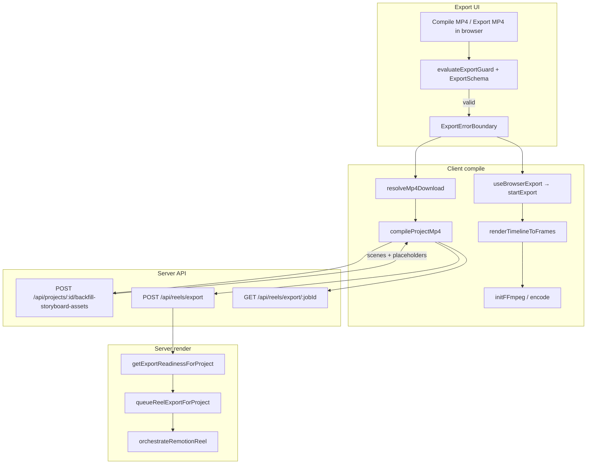

# Export Pipeline Trace

**Date:** 2026-06-05  
**Scope:** Quick Cut MP4 export — server Remotion path + browser FFmpeg/WebCodecs path

---

## Architecture

---

## Step-by-step trace

| Step | File | Function | Input | Output | Failure point |
|------|------|----------|-------|--------|---------------|
| 1 | `export-tabbed-panel.tsx` | `handleDownloadMp4` | store: scenes, voiceUrl, projectId | calls `resolveMp4Download` | Guard blocks if no project/script/scenes |
| 2 | `browser-export-preflight.tsx` | `runExport` onClick | `reelTimeline`, projectId | calls `startExport` | Guard + capabilities blockers |
| 3 | `export-guards.client.ts` | `evaluateExportGuard` | projectId, script, scenes | `{ allowed, message }` | Blocks UI before network |
| 4 | `export-schema.ts` | `validateExportReadinessInput` | scenes[], projectId | zod-validated payload | Returns "Project data incomplete" |
| 5 | `resolve-mp4-download.client.ts` | `compileAndDownload` | projectId, filename | MP4 URL + download | Propagates compile errors |
| 6 | `compile-project-mp4.client.ts` | `compileProjectMp4Inner` | projectId | reel URL string | Missing voice, poll import guard |
| 7 | `backfill-storyboard-assets/route.ts` | `POST` | project id | `{ success, recovered, scenes }` | **Was 500** — now always 200/400 with body |
| 8 | `backfill-storyboard-assets.server.ts` | `backfillStoryboardAssetsForProject` | row, userId | repaired scenes + placeholders | Per-scene try/catch; attachPlaceholder |
| 9 | `export-api` route | `POST /api/reels/export` | `{ projectId, quality }` | `{ jobId }` or `{ reelUrl }` | **400** when readiness fails (missing assets) |
| 10 | `export-readiness.server.ts` | `getExportReadinessForProject` | row, userId | `{ canExport, missingAssets }` | Returns 400 upstream when false |
| 11 | `export-poll.client.ts` | `pollReelExportJob` | poll URL | completed reel URL | Dynamic import guarded |
| 12 | `export-orchestrator.ts` | `startExport` | BrowserExportJob | MP4 blob | FFmpeg `toBlobURL` guard; safe timeline |
| 13 | `timeline-frame-renderer.client.ts` | `renderTimelineToFrames` | ReelTimeline | ImageBitmap[] | Placeholder canvas on load fail |
| 14 | `ffmpeg-service.ts` | `initFFmpeg` | threaded flag | FFmpeg instance | `FFmpeg`/`toBlobURL` typeof guard |

---

## Root causes (fixed)

### "I is not a function"

| Location | Line | Cause |
|----------|------|-------|
| `lib/export/ffmpeg-service.ts` | ~49–59 | Minified `@ffmpeg/util` `toBlobURL`/`fetchFile` undefined when bundle/HMR fails |
| `lib/export/timeline-frame-renderer.client.ts` | ~49–62 | `createImageBitmap` / `transferToImageBitmap` called without typeof guard |
| `lib/quick-cut/compile-project-mp4.client.ts` | ~143–152 | Dynamic import `pollReelExportJob` / `reelExportPollPath` without guard |
| `stores/quick-cut-generation-store.ts` | ~1631–1643 | Same poll import path in `pollRenderJob` |

**Fix:** Runtime `typeof fn === 'function'` guards + user-facing fallback messages.

### React Error #423 (hydration recoverable)

| Location | Line | Cause |
|----------|------|-------|
| `components/quick-cut/browser-export-preflight.tsx` | ~80–118 | SSR rendered `hardwareConcurrency: 1`; client rendered actual core count |
| `components/quick-cut/export-tabbed-panel.tsx` | ~460–470 | Tab state from Zustand before mount (fixed in 2564dee) |
| `components/quick-cut/preview-export-tabbed-panel.tsx` | ~62–78 | Same tab hydration pattern (fixed in 2946935) |

**Fix:** `mounted` gate — defer capability diagnostics and store-driven tabs until after hydration.

### POST `/api/reels/export` → 400

**Cause:** Downstream of failed/missing storyboard assets. `getExportReadinessForProject` returns `canExport: false` when scenes lack durable `imageUrl`/`imageAssetPath` after backfill.

**Fix:** Client-side zod + guard blocks API call when incomplete; server backfill attaches placeholders; clearer JSON `{ error, missingAssets, stage }`.

### POST `/api/projects/:id/backfill-storyboard-assets` → 500

**Cause:** Uncaught exceptions in per-scene regeneration (`generateSceneImageOpenAIPrimary`), Supabase client init, or `refreshAllSceneStoryboardUrls` — route catch returned generic 500.

**Fix:** Per-scene try/catch; graceful Supabase fallback; `attachPlaceholders` for missing stills; route **never returns 500** — returns `{ success: true, recovered, missingAssets }`.

---

## Hardening modules

| Module | Purpose |
|--------|---------|
| `lib/export/export-placeholders.ts` | `DEFAULT_PLACEHOLDER`, `createPlaceholderStoryboard`, `ensureExportSafeScenes` |
| `lib/export/export-schema.ts` | Zod `ExportRequestSchema`, `ExportReadinessInputSchema` |
| `lib/export/export-guards.client.ts` | `evaluateExportGuard`, "Generate storyboard before exporting" |
| `lib/export/export-log.client.ts` | `console.group("[MUGTEE EXPORT]")` observability |
| `components/quick-cut/export-error-boundary.tsx` | Catches render/runtime errors in export panel |

---

## Test scenarios

### A — Happy path (server compile)

1. Complete Quick Cut project with all scene stills + voice.
2. Export tab → **Compile MP4**.
3. Expect: `POST /api/reels/export` → 200 + `jobId`; poll completes; download works.
4. Console: `[MUGTEE EXPORT] compile_click` → `backfill` → `api_request` → `compile.complete`.

### B — Missing storyboard images

1. Project with voice but one scene missing `imageUrl`.
2. Click Compile MP4.
3. Expect: Guard or API 400 with `missingAssets`; **no crash**, no 500.
4. Backfill returns `{ success: true, missingAssets: [...] }` with placeholders attached when possible.

### C — Browser export with partial clips

1. Complete project → **Export MP4 in browser**.
2. Expect: Placeholder frames for missing URLs; MP4 downloads or clear error (not "I is not a function").
3. Diagnostics show after mount (no React #423).

### D — Backfill legacy project

1. Project with expired Pollinations URLs.
2. Trigger backfill via compile.
3. Expect: 200 response, `recovered: true` or `missingAssets` list; never 500.

### E — Export guard (no storyboard)

1. Empty scenes array or unsaved project.
2. Export buttons disabled or toast: "Generate storyboard before exporting."
3. No API calls fired.

### F — Error boundary recovery

1. Force a throw in export child (dev only).
2. Expect: "Export failed. Your project is safe. Try again." + Retry button.
3. Project state unchanged in store.

---

## Remaining risks

- **Placeholder images in server Remotion export** use Unsplash URLs — offline/CDN blocks may still fail server render; client browser path draws canvas fallback.
- **Voice URL CORS** — browser mux may fail if voice asset blocks cross-origin fetch; server path unaffected.
- **VIDEO_RENDER_ENABLED=false** on production returns 503 (operational, not code).
- **Long exports OOM** on low-memory devices — warnings shown but not auto-retried.

---

## Observability log points

| Stage | Location |
|-------|----------|
| compile click | `export-tabbed-panel.tsx` → `mugteeExportGroup('compile_click')` |
| browser click | `use-browser-export.client.ts` → `mugteeExportGroup('browser_click')` |
| payload build | `export-schema.ts` via compile/browser callers |
| backfill | `compile-project-mp4.client.ts` → `mugteeExportGroup('backfill')` |
| API request | `compile-project-mp4.client.ts` → `mugteeExportGroup('api_request')` |
| compiler start/complete | `export-orchestrator.ts`, `timeline-frame-renderer.client.ts` |
