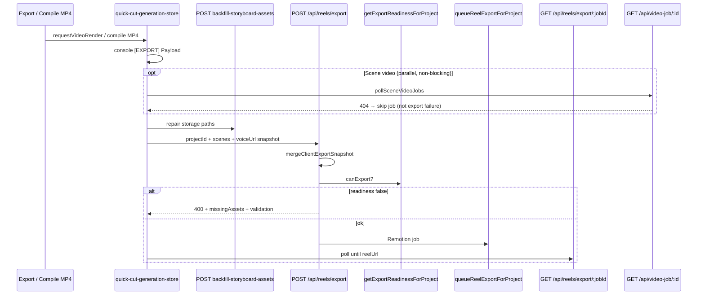

# Export Post-Payload Trace

**Date:** 2026-06-05  
**Scope:** Failures after client `[EXPORT] Payload` log — `GET /api/video-job/:id` 404 and `POST /api/reels/export` 400

---

## Summary

| Symptom | Required for MP4? | Fix |
|---------|-------------------|-----|
| `GET /api/video-job/svid-*` → 404 | **No** — optional Seedance/Runway scene clips | Skip polling per job; continue with storyboard stills |
| `POST /api/reels/export` → 400 | **Yes** — server Remotion queue | Merge client snapshot into DB row; field-level validation JSON |

---

## Flow (after payload)



---

## video-job references (all)

| File | Line(s) | Role |
|------|---------|------|
| `app/api/video-job/[id]/route.ts` | 2, 12 | GET handler — 404 when ephemeral job missing |
| `app/api/generate-scene-video/route.ts` | 14, 113, 121 | Creates job; returns `pollUrl` |
| `lib/video/video-job.ts` | 24, 64, 93, 100, 115 | In-memory + `/tmp` store |
| `lib/video/index.ts` | 13 | Re-exports job helpers |
| `lib/video/process-scene-video.server.ts` | 16 | Updates job status |
| `lib/cinematic/scene-video-pipeline.client.ts` | 24, 42, 88, 104 | `pollVideoJob`, `queueSceneVideos`, `pollSceneVideoJobs` |
| `stores/quick-cut-generation-store.ts` | 82–83, 1158, 1177 | Optional scene video generation |
| `lib/cinematic/generation-logger.ts` | 22 | `videoJobId` in asset log payload |
| Docs / reports | various | Architecture notes only |

**Note:** `waitForVideoJob` / `getVideoJobStatus` — not present; polling is `pollVideoJob` / `pollSceneVideoJobs`.

---

## reels/export 400 causes

| Stage | `stage` field | Typical cause |
|-------|---------------|---------------|
| Zod body | `request_validation` | Missing `projectId`, invalid `quality` |
| Readiness | `export_readiness` | DB row missing images/voice after merge |
| Asset HEAD | `storyboard_asset_loading` | Expired URLs unreachable |
| Queue throw | `export_queue` / `voice_asset_loading` | `queueReelExportForProject` validation |

Server logs: `EXPORT REQUEST`, `[EXPORT_VALIDATION]`, `console.error(flatten())` on schema failure.

---

## Client payload vs schema

**Sent today (store + compile):**

```json
{
  "projectId": "uuid",
  "quality": "1080p",
  "includeVoiceover": true,
  "includeCaptions": true,
  "scenes": [{ "id", "title", "imageUrl", "imageAssetPath" }],
  "storyboards": [{ "id", "title", "imageUrl", "imageAssetPath" }],
  "script": "...",
  "voiceUrl": "https://...",
  "thumbnailUrl": "https://..."
}
```

**Zod:** `lib/export/export-schema.ts` → `ExportRequestSchema`

Legacy minimal payload `{ projectId, quality }` still valid; snapshot fields optional.

---

## STEP_FAILED / GENERATION_ERROR

| Log | Source | Export impact |
|-----|--------|---------------|
| `[STEP_FAILED]` | `logStepFailed` in `generation-logger.ts` | Generation steps only |
| `[GENERATION_ERROR]` | `logGenerationError` | Generation pipeline |
| `[EXPORT_VALIDATION]` | `app/api/reels/export/route.ts` | Blocks queue with 400 |

Scene video 404 does **not** emit STEP_FAILED for export; `runSceneVideoGeneration` catch is non-blocking.
