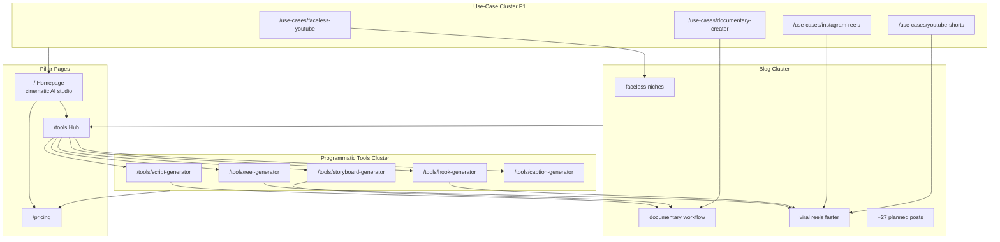

# Mugtee Growth Engine — SEO & Acquisition Roadmap

**Product:** [Mugtee AI Studio](https://mugtee.in) — cinematic AI studio for faceless, reel, YouTube, and documentary creators  
**Domain state:** New domain, ~0 DA, no backlinks, minimal indexed pages (homepage, pricing, 3 blog posts)  
**Production:** `mugtee.in` on Vercel  
**Studio modes:** **Quick Cut** (`/studio/quick`, purple) · **Director Mode** (`/studio/director`, gold)  
**Positioning:** Workflow-driven cinematic storytelling — **not** a generic AI writer or chatbot  

**Companion docs:** [sitemap-structure.md](./sitemap-structure.md) · [programmatic-seo-pages.md](./programmatic-seo-pages.md)

---

## Executive summary

Mugtee wins organic growth by owning **creator workflow keywords** (script → storyboard → reel → export) with programmatic tool pages, a disciplined blog cluster, and distribution that shows **real output quality** (before/after, storyboard frames, export strips). First 90 days prioritize indexation, GSC/GA4/PostHog/Clarity instrumentation, Product Hunt launch, and 50 high-intent directory/community submissions — not paid ads. Goal: **1,000 registered users** with realistic traffic ramp (~200–400 organic sessions/mo by day 90).

---

## 1. SEO Architecture

### Primary keyword clusters

| Cluster | Primary keywords | Search intent | Target URLs |
|---------|------------------|---------------|-------------|
| **A — Cinematic AI studio** | ai reel generator, cinematic ai video, ai short form video maker | Commercial / transactional | `/`, `/tools/reel-generator` |
| **B — Script & narration** | ai script generator, youtube script generator ai, documentary script ai | Commercial | `/tools/script-generator`, blog scripting cluster |
| **C — Storyboard & visuals** | ai storyboard generator, storyboard maker ai, reel storyboard | Commercial | `/tools/storyboard-generator` |
| **D — Hooks & retention** | hook generator, viral hook generator, instagram hook generator | Commercial / informational | `/tools/hook-generator`, blog hooks cluster |
| **E — Captions & export** | ai caption generator, reel caption generator, export ready reel | Commercial | `/tools/caption-generator`, blog reels cluster |
| **F — Faceless YouTube** | faceless youtube channel ai, faceless youtube niches, ai faceless video | Informational → commercial | `/use-cases/faceless-youtube`, existing niche blog post |
| **G — Documentary & long narration** | documentary script template, ai documentary workflow, narration script ai | Informational | `/blog/ai-documentary-script-workflow`, Director Mode landing copy |
| **H — Platform-specific** | instagram reel maker ai, youtube shorts script ai, vertical video ai | Commercial | `/use-cases/instagram-reels`, reel tool page |

### Secondary keyword clusters (supporting)

| Cluster | Secondary keywords | Link from |
|---------|-------------------|-----------|
| B-support | b roll prompts ai, scene breakdown template | Script + storyboard posts |
| D-support | scroll stop hook examples, first 3 seconds reel | Hook tool + reels blog |
| F-support | faceless channel ideas 2026, youtube automation without face | Faceless niche post (live) |
| G-support | voiceover script generator, emotional pacing narration | Documentary workflow post (live) |
| Platform | tiktok script generator, shorts retention tips | Viral reels post (live) |
| Brand | mugtee, mugtee ai, mugtee studio | Branded SERP defense (about, PH, socials) |

### Topic cluster architecture (Mermaid)

### Landing page structure (homepage + templates)

| Section | Purpose | Primary keyword signal |
|---------|---------|------------------------|
| Hero | Cinematic reel studio + dual CTA (Open Studio / See action) | ai reel generator, cinematic reel |
| Workflow strip | Idea → hook → script → storyboard → export (not chat UI) | workflow, export ready reel |
| Quick Cut vs Director | Mode differentiation (purple vs gold) | quick cut vs director mode |
| Output preview | Artifact strip (hook, beat, frame, caption) | storyboard, script generator |
| Proof / journey | 3-step “hold idea → direct arc → present” | documentary, faceless creator |
| Pricing teaser | Begin free → Studio ₹245 | ai video tool pricing india |
| FAQ | Indexable text block | long-tail questions |
| Footer hub links | Blog, tools, legal | internal PageRank flow |

### Internal linking strategy

1. **Hub-and-spoke:** `/tools` → each tool page; every tool page links to 2 siblings + 1 blog post + `/pricing`.
2. **Blog → money pages:** Each post ends with “Run this in Mugtee” CTA linking to the matching `/tools/*` URL (not only `/login`).
3. **Breadcrumb:** Home > Tools > {Tool Name} (implement when routes exist).
4. **Anchor diversity:** 60% branded (“Mugtee”, “Open Studio”), 40% exact/partial match anchors across clusters A–H.
5. **Avoid:** Linking authenticated `/studio/*` URLs in sitemap; use `?next=` login deep links in CTAs only.

### Sitemap structure

See [sitemap-structure.md](./sitemap-structure.md). **P0:** extend `app/sitemap.ts` when `/tools/*` ships.

| Priority | Action |
|----------|--------|
| **P0** | GSC property + sitemap submit; fix login canonical |
| **P0** | Publish `/tools` hub + top 3 tool pages |
| **P1** | `/use-cases/*` hub + 4 pages |
| **P1** | 2 new blog posts/week with internal links |
| **P2** | Comparison pages (ethical, factual) |
| **P3** | Localized `/hi/` or India creator glossary (optional) |

---

## 2. Blog Strategy

**Cadence:** 2 posts/week weeks 1–8, then 1/week. **Length:** 1,200–2,000 words. **Voice:** Creator-operator, show Mugtee workflow screenshots — no fake case studies or inflated metrics.

### 30 SEO blog ideas

| # | Title (slug idea) | Target keyword | Search intent | SEO difficulty (1–10) | Funnel stage | CTA |
|---|-------------------|----------------|---------------|----------------------|--------------|-----|
| 1 | Best faceless YouTube niches 2026 *(live)* | faceless youtube niches | Informational | 6 | Awareness | Open Studio |
| 2 | AI documentary script workflow *(live)* | documentary script ai | Informational | 5 | Consideration | Try script tool |
| 3 | Viral reels faster without burnout *(live)* | how to make viral reels faster | Informational | 7 | Awareness | Reel generator |
| 4 | Mugtee Quick Cut vs Director Mode | quick cut vs director editing | Commercial | 4 | Consideration | Open Quick Cut |
| 5 | Hook formulas that survive 2026 algorithm | reel hook formulas | Informational | 6 | Awareness | Hook generator |
| 6 | Storyboard frames before AI video gen | storyboard before ai video | Informational | 5 | Consideration | Storyboard tool |
| 7 | Faceless channel starter kit (30 days) | start faceless youtube channel | Informational | 6 | Awareness | Sign up free |
| 8 | Documentary narration pacing guide | documentary narration pacing | Informational | 4 | Consideration | Director Mode |
| 9 | YouTube Shorts script structure template | youtube shorts script template | Informational | 5 | Consideration | Script generator |
| 10 | Caption timing for silent viewers | reel caption timing | Informational | 4 | Consideration | Caption tool |
| 11 | B-roll prompt library for AI visuals | b roll prompts ai | Informational | 5 | Awareness | Storyboard tool |
| 12 | 9:16 composition rules for reels | vertical video composition | Informational | 3 | Awareness | Reel generator |
| 13 | Why generic ChatGPT scripts fail on camera | ai script vs chatgpt | Commercial | 5 | Consideration | Mugtee workflow post |
| 14 | Export-ready reel checklist | export ready instagram reel | Informational | 4 | Decision | Open Studio |
| 15 | Faceless video monetization (realistic) | faceless youtube monetization | Informational | 7 | Awareness | Pricing page |
| 16 | Emotional arc for 60-second reels | emotional arc short video | Informational | 4 | Consideration | Quick Cut |
| 17 | Voice match and tone consistency | ai voiceover consistency | Informational | 5 | Consideration | Studio signup |
| 18 | Story beat sheet for explainers | explainer video script template | Informational | 5 | Consideration | Script tool |
| 19 | Retention editing: first 3 seconds | first 3 seconds reel retention | Informational | 6 | Awareness | Hook generator |
| 20 | India creator pricing: AI tools vs editors | ai video tool pricing india | Commercial | 5 | Decision | Pricing |
| 21 | Made with Mugtee: how we showcase | cinematic ai examples | Branded | 3 | Decision | Showcase page |
| 22 | MP4 export pipeline explained | ai reel export mp4 | Informational | 4 | Consideration | Export blog + studio |
| 23 | Documentary vs reel tone in one tool | documentary vs reel script tone | Informational | 4 | Consideration | Director vs Quick |
| 24 | Weekly content system for solo creators | solo creator content system | Informational | 5 | Awareness | Studio |
| 25 | Instagram carousel vs reel script reuse | repurpose reel to carousel | Informational | 4 | Awareness | Script tool |
| 26 | YouTube automation without losing soul | youtube automation faceless | Informational | 6 | Awareness | Faceless use-case |
| 27 | Scene count math for 30s vs 60s reels | reel scene count guide | Informational | 3 | Consideration | Storyboard |
| 28 | CTA lines that don’t sound desperate | reel cta examples | Informational | 4 | Consideration | Caption + script |
| 29 | Pre-launch teaser reel workflow | product teaser reel script | Informational | 4 | Awareness | Reel generator |
| 30 | Mugtee launch lessons (founder) | building cinematic ai studio | Branded | 2 | Awareness | PH + signup |

| Priority | Action |
|----------|--------|
| **P0** | Publish #4, #5, #6 within 14 days (support tool launch) |
| **P1** | #7–#15 over days 15–45 |
| **P2** | #16–#25 |
| **P3** | #26–#30 + refresh live posts quarterly |

---

## 3. Programmatic SEO

Five landing pages under `/tools/*` plus hub. Full copy specs: [programmatic-seo-pages.md](./programmatic-seo-pages.md).

| Page | SEO title (≤60 chars) | Priority |
|------|----------------------|----------|
| Hub `/tools` | Free AI Tools for Reels, Scripts & Storyboards \| Mugtee | P0 |
| script-generator | AI Script Generator for Reels & YouTube \| Mugtee | P0 |
| reel-generator | AI Reel Generator — Script to Export \| Mugtee | P0 |
| storyboard-generator | AI Storyboard Generator for Reels \| Mugtee | P1 |
| hook-generator | Viral Hook Generator for Reels \| Mugtee | P1 |
| caption-generator | AI Caption Generator for Reels \| Mugtee | P1 |

**CTA placement pattern (all pages):** hero secondary + post-proof primary + footer; mobile sticky after first scroll.

| Priority | Action |
|----------|--------|
| **P0** | Implement hub + reel + script routes (static MDX or `page.tsx` + shared layout) |
| **P0** | Add URLs to `sitemap.ts`; request indexing in GSC |
| **P1** | Remaining three tools + FAQ schema |
| **P2** | A/B hero CTA copy via PostHog |
| **P3** | Dynamic “{platform} reel generator” variants (guard against thin content) |

---

## 4. Product Hunt Launch

**Positioning:** *Your Cinematic AI Studio* — faceless/reel/YouTube/documentary pipeline from one idea to export. **Not:** AI writer, chatbot, or “ChatGPT for scripts.”

### Listing copy

| Field | Copy |
|-------|------|
| **Tagline** (≤60 chars) | Your cinematic AI studio — idea to export-ready reel |
| **Short description** | Mugtee turns one idea into hook, script, storyboard, captions, and export-ready vertical video. Quick Cut for speed, Director Mode for cinematic control — workflow, not chat. |
| **Long description** | Creators shipping faceless YouTube, documentaries, and reels lose days bouncing between ChatGPT, Canva, and CapCut. Mugtee is a **cinematic AI studio**: one workflow from emotional idea to directed artifacts you can publish.\n\n**Quick Cut** (`/studio/quick`) — purple, fast path from prompt to script, frames, voice, and export.\n\n**Director Mode** (`/studio/director`) — gold, deeper control over hook, pacing, visual direction, and refinement.\n\nUnlike generic AI writers, Mugtee is built around **story beats, 9:16 framing, and export continuity** — the same pipeline professional short-form directors use, compressed for solo creators.\n\nFree to begin on mugtee.in. Built for creators who care how the reel *feels*, not just that it exists. |
| **First comment (maker)** | Hey PH — I’m building Mugtee because I was tired of “AI scripts” that sound fine in a doc and die on camera. Mugtee is workflow-first: hook → script → storyboard → captions → export. Would love feedback on Quick Cut vs Director Mode — which workflow should we polish first for your stack? 🎬 |
| **Gallery** | 6–8 frames: homepage hero, Quick Cut pipeline, storyboard strip, export success, Director Mode gold UI, before/after hook |

### FAQ (for PH + landing)

| Question | Answer |
|----------|--------|
| Is Mugtee a chatbot? | No. It’s a workflow studio — structured stages, not open-ended chat. |
| What can I export? | Script assets, storyboard frames, captions; MP4 export on supported plans (see pricing). |
| Quick Cut vs Director Mode? | Quick Cut optimizes speed; Director Mode adds refinement and cinematic control. |
| Who is it for? | Faceless YouTube, documentary, reel, and Shorts creators. |
| Pricing? | Free Begin tier; Studio from ₹245/mo — see mugtee.in/pricing. |
| vs ChatGPT? | Mugtee connects hook, pacing, visuals, and export in one cinematic pipeline. |

### Launch assets checklist

- [ ] PH thumbnail 240×240 (M gold mark, dark cinematic bg)
- [ ] Gallery images 1270×760 (5–8 screens)
- [ ] 60s demo video (screen recording + light VO)
- [ ] Maker comment drafted + team upvote plan (no brigading)
- [ ] `/ph` or UTM `?utm_source=producthunt` on all CTAs
- [ ] Status page / support email monitored launch day
- [ ] Post-launch blog #30 + X/LinkedIn thread

| Priority | Action |
|----------|--------|
| **P0** | Asset pack + hunter/maker alignment 1 week before launch |
| **P0** | Ship demo video showing real export (not mock) |
| **P1** | PH launch day + Indie Hackers post same week |
| **P2** | PH badge on homepage footer after launch |
| **P3** | Second PH “update” launch at +90 days if major feature ships |

---

## 5. Backlink Acquisition

**Goal:** 50 relevant placements in 90 days; prioritize creator-fit and AI/SaaS directories over spammy lists.

| # | Category | Site / opportunity | DR (est.) | Submission URL | Difficulty | Priority |
|---|----------|-------------------|-----------|----------------|------------|----------|
| 1 | AI directory | Futurepedia | 72 | https://www.futurepedia.io/submit-tool | Medium | P0 |
| 2 | AI directory | There's An AI For That | 68 | https://theresanaiforthat.com/submit/ | Medium | P0 |
| 3 | AI directory | Toolify.ai | 55 | https://www.toolify.ai/submit | Easy | P0 |
| 4 | AI directory | AI Tools Directory | 45 | https://aitoolsdirectory.com/submit | Easy | P0 |
| 5 | AI directory | TopAI.tools | 50 | https://topai.tools/submit | Easy | P0 |
| 6 | AI directory | OpenTools | 48 | https://opentools.ai/register | Easy | P1 |
| 7 | AI directory | Aixploria | 42 | https://www.aixploria.com/en/submit-ai/ | Easy | P1 |
| 8 | AI directory | Supertools | 40 | https://supertools.therundown.ai/submit | Easy | P1 |
| 9 | AI directory | Ben's Bites directory | 55 | https://news.bensbites.com/submit | Medium | P1 |
| 10 | AI directory | Uneed | 38 | https://uneed.best/submit-a-tool | Easy | P1 |
| 11 | Startup dir | BetaList | 62 | https://betalist.com/submit | Medium | P0 |
| 12 | Startup dir | Launching Next | 45 | https://www.launchingnext.com/submit/ | Easy | P1 |
| 13 | Startup dir | StartupBuffer | 35 | https://startupbuffer.com/submit | Easy | P1 |
| 14 | Startup dir | SaaSHub | 58 | https://www.saashub.com/submit | Medium | P0 |
| 15 | Startup dir | AlternativeTo | 88 | https://alternativeto.net/contribute/ | Hard | P1 |
| 16 | Startup dir | Slant | 65 | https://www.slant.co/ | Hard | P2 |
| 17 | Startup dir | Capterra (free listing) | 91 | https://www.capterra.com/vendors/sign-up | Hard | P2 |
| 18 | Startup dir | G2 (free profile) | 91 | https://www.g2.com/products/new | Hard | P2 |
| 19 | PH ecosystem | Product Hunt | 91 | https://www.producthunt.com/posts/new | Medium | P0 |
| 20 | PH ecosystem | Product Hunt Ship | 91 | https://www.producthunt.com/ship | Medium | P1 |
| 21 | Indie | Indie Hackers product | 80 | https://www.indiehackers.com/products | Easy | P0 |
| 22 | Indie | Indie Hackers milestone post | 80 | https://www.indiehackers.com/post/new | Easy | P0 |
| 23 | Indie | Hacker News Show HN | 91 | https://news.ycombinator.com/submit | Hard | P1 |
| 24 | Indie | Dev.to launch post | 85 | https://dev.to/new | Easy | P1 |
| 25 | Indie | Hashnode cross-post | 75 | https://hashnode.com/ | Easy | P1 |
| 26 | Creator | r/NewTubers | — | https://www.reddit.com/r/NewTubers/ (follow rules) | Medium | P1 |
| 27 | Creator | r/PartneredYoutube | — | https://www.reddit.com/r/PartneredYoutube/ | Hard | P2 |
| 28 | Creator | r/ContentCreation | — | https://www.reddit.com/r/ContentCreation/ | Medium | P1 |
| 29 | Creator | r/InstagramMarketing | — | https://www.reddit.com/r/InstagramMarketing/ | Medium | P1 |
| 30 | Creator | r/SideProject | — | https://www.reddit.com/r/SideProject/ | Easy | P0 |
| 31 | Creator | r/alphaandbetausers | — | https://www.reddit.com/r/alphaandbetausers/ | Easy | P0 |
| 32 | Creator | r/SaaS | — | https://www.reddit.com/r/SaaS/ | Medium | P1 |
| 33 | Creator | Faceless YouTube Facebook groups | — | Search “faceless youtube” groups | Medium | P2 |
| 34 | Creator | Skool creator communities | — | Niche Skool paid communities — ask mods | Hard | P2 |
| 35 | Creator | Discord: Content Creators Cabin | — | Discord invite via creator networks | Medium | P2 |
| 36 | Newsletter | The Rundown AI sponsor/listing | 65 | https://therundown.ai/ | Hard | P2 |
| 37 | Newsletter | Creator Logic / similar | 40 | Direct outreach | Hard | P2 |
| 38 | Podcast | Creator podcasts guest pitch | — | Outreach template | Hard | P3 |
| 39 | Guest post | Faceless YouTube blogs | 30–50 | Outreach | Hard | P2 |
| 40 | Guest post | Video editing blogs | 40–60 | Outreach | Hard | P2 |
| 41 | India | YourStory / Inc42 startup (if fundraising) | 80+ | Press pages | Hard | P3 |
| 42 | India | Indian SaaS communities (SaaSBoomi) | — | Events / Slack | Medium | P2 |
| 43 | Tool list | Awesome AI Tools (GitHub PR) | — | GitHub search “awesome-ai-tools” | Easy | P1 |
| 44 | Tool list | Awesome Generative AI | — | GitHub PR | Easy | P1 |
| 45 | Design | Dribbble shot (brand) | 90 | https://dribbble.com/shots/new | Easy | P2 |
| 46 | Design | Behance case study | 90 | https://www.behance.net/ | Medium | P2 |
| 47 | Video | YouTube description link | 99 | Own channel | Easy | P0 |
| 48 | Video | Product demo on YouTube | 99 | Upload + link mugtee.in | Easy | P0 |
| 49 | Partnership | CapCut / Canva communities (tips, not spam) | — | Comment value-first | Medium | P2 |
| 50 | Partnership | Creator newsletter swap | — | Cross-promo with 5–20k subs | Hard | P2 |

**Outreach rules:** Value-first comment/post, disclose maker identity, link to **tool page** or **workflow blog**, never fake testimonials.

| Priority | Action |
|----------|--------|
| **P0** | Rows 1–5, 11, 14, 19, 21–22, 30–31, 47–48 (15 submissions week 1–2) |
| **P1** | Remaining Easy/Medium through day 60 |
| **P2** | Hard directories + guest posts |
| **P3** | Podcast + India press |

---

## 6. Content Distribution Engine

Distribution proves **output quality** — storyboard frames, hook before/after, export strip — not feature lists.

### Instagram

| Element | Strategy |
|---------|----------|
| Format | 9:16 reels + carousel “director’s cut” of one Mugtee project |
| Content pillars | Before/after hook · 3-frame storyboard timelapse · export screen recording · creator POV “one idea in” |
| Cadence | 4 reels/week + 2 carousels/week |
| CTA | Link in bio → `/tools/reel-generator?utm_source=instagram` |
| KPI | Saves + shares > likes; profile link CTR |

### LinkedIn

| Element | Strategy |
|---------|----------|
| Format | Founder/build-in-public + workflow screenshots |
| Content pillars | “Why cinematic AI isn’t a chatbot” · Quick Cut vs Director · India creator economics |
| Cadence | 3 posts/week |
| CTA | Comment “studio” → DM link or direct mugtee.in |
| KPI | Follower growth from creator operators; signup UTM `linkedin` |

### Reddit

| Element | Strategy |
|---------|----------|
| Subreddits | r/SideProject, r/alphaandbetausers, r/NewTubers, r/ContentCreation (see backlink table) |
| Rules | 90% value comments, 10% product mentions; never astroturf |
| Content | “I built a workflow studio” posts with **real** screen recording |
| KPI | Qualified traffic spikes; monitor bounce in GA4 |

### X (Twitter)

| Element | Strategy |
|---------|----------|
| Format | Threads: hook variants, storyboard frame drops, PH launch thread |
| Cadence | 1 thread/week + 3 short posts/week |
| CTA | PH launch pin + tool page links |
| KPI | Impressions on launch week; link clicks |

### YouTube Shorts

| Element | Strategy |
|---------|----------|
| Format | 20–45s “idea → export” timelapse; faceless VO |
| Content | Same projects as IG; SEO titles with “AI reel workflow” |
| Cadence | 3 Shorts/week |
| CTA | Description link + pinned comment |
| KPI | Subscribers from creator niche; traffic to `/tools/reel-generator` |

### Case study format (no fake metrics)

Template: **Creator type → idea input → Mugtee artifacts (screenshots) → time saved (self-reported) → quote (optional, real name only with permission)**. Publish on `/made-with-mugtee` when consent exists.

| Priority | Action |
|----------|--------|
| **P0** | Record 1 hero demo + 3 Shorts/reels from same project |
| **P0** | UTM scheme: `utm_source={platform}&utm_medium=social&utm_campaign=growth90` |
| **P1** | Weekly distribution calendar tied to blog publish |
| **P2** | First consented case study on showcase |
| **P3** | Paid micro-influencer tests (only after organic baseline) |

---

## 7. Analytics Setup

### Stack implementation plan

| Tool | Purpose | Implementation steps | Priority |
|------|---------|----------------------|----------|
| **Google Search Console** | Indexing, queries, CTR | Add `mugtee.in` property (URL prefix + domain); verify via DNS TXT on Vercel; submit `sitemap.xml`; enable email alerts | P0 |
| **GA4** | Traffic, acquisition, conversions | Create GA4 property; add `gtag.js` via `next/script` in `app/layout.tsx` or `@next/third-parties/google`; define conversions (signup, CTA click); link to Google Ads later (optional) | P0 |
| **PostHog** | Product funnels, feature flags | Already wired: `NEXT_PUBLIC_POSTHOG_KEY`, `components/analytics/analytics-boot.tsx`, `lib/posthog.ts` — verify production env on Vercel; create dashboards: signup funnel, export funnel | P0 |
| **Microsoft Clarity** | Heatmaps, rage clicks | Sign up at clarity.microsoft.com; inject script in root layout (exclude `/studio` if noisy); mask sensitive fields | P1 |
| **Supabase `analytics_events`** | First-party backup | Already dual-written from `trackEvent` — use for export funnel audits (`lib/analytics/events.ts`) | P0 |

### Events to track (align with existing `AnalyticsEvents`)

| Event | Trigger | Platform |
|-------|---------|----------|
| `homepage_visit` / `landing_page_viewed` | First load | PostHog + Supabase (live) |
| `hero_cta_clicked` | Homepage primary CTA | PostHog + Supabase |
| `signup_started` | Auth modal / login page | PostHog + Supabase |
| `signup_completed` | Auth callback success (`app/auth/callback`) | PostHog + Supabase + GA4 conversion |
| `first_project_created` | First project API success | PostHog + Supabase + GA4 |
| `project_created` | Any new project | PostHog + Supabase |
| `generation_completed` | Quick Cut / director pipeline done | PostHog + Supabase |
| `export_completed` | MP4/script export success | PostHog + Supabase + GA4 |
| `pricing_page_view` | `/pricing` view | PostHog |
| `final_cta_clicked` | Footer CTA | PostHog |
| **New (add)** `tool_page_viewed` | `/tools/{slug}` | PostHog + GA4 |
| **New (add)** `workflow_mode_selected` | quick vs director entry | PostHog |

### Dashboards (week 2)

1. **Acquisition:** sessions by source/medium, landing page report  
2. **Activation:** signup → first project → first generation → export (7-day window)  
3. **SEO:** GSC impressions/clicks by page; top queries  
4. **Content:** blog → signup path (UTM + page referrer)

| Priority | Action |
|----------|--------|
| **P0** | GSC + GA4 live; PostHog prod key verified |
| **P0** | Mark GA4 conversions: signup, first_project, export |
| **P1** | Clarity + tool page events |
| **P2** | Weekly growth review doc (Notion/sheet) |
| **P3** | BigQuery export if volume warrants |

---

## 8. 90-Day Traffic Plan (Goal: 1,000 users)

**Assumptions (new domain, realistic):**  
- Month 1: mostly direct/social/PH; organic 20–80 sessions  
- Month 2: programmatic pages index; organic 80–200 sessions  
- Month 3: blog compound + directories; organic 200–400 sessions  
- **Signup rate (visitor → registered):** 8–15% on tool/PH traffic, 3–8% on cold blog  
- **Cumulative signups target:** ~1,000 by day 90 (requires ~6,000–10,000 unique visitors — achievable with PH + directories + consistent content)

### Days 1–30 — Foundation & indexation

| Week | Tasks | KPIs | Expected traffic (cum. uniques) | Expected signups (cum.) |
|------|-------|------|-----------------------------------|-------------------------|
| 1 | GSC/GA4/PostHog verify; sitemap submit; login canonical; start `/tools` hub + reel + script pages | GSC: 5+ URLs discovered | 200–500 | 20–50 |
| 2 | Ship 3 tool pages; 2 blog posts (#4–#5); 15 directory submissions | 3 tool pages indexed | 500–1,200 | 60–120 |
| 3 | Demo video + IG/Shorts (3); Indie Hackers + r/SideProject posts | PH assets ready | 800–2,000 | 100–200 |
| 4 | **Product Hunt launch**; email waitlist if any; monitor errors | PH top 10 daily goal (stretch) | 2,500–6,000 | 200–400 |

**Day 30 targets:** 400+ signups (stretch 500) · 6+ indexed money pages · GSC showing first impressions

### Days 31–60 — Compound content & links

| Week | Tasks | KPIs | Expected traffic (month uniques) | Expected signups (month) |
|------|-------|------|----------------------------------|--------------------------|
| 5–6 | Hook + storyboard + caption tools; 4 blog posts; Clarity live | 10+ indexed URLs | 1,500–3,000 | 150–250 |
| 7–8 | `/use-cases/faceless-youtube` + instagram reels; 20 more directory links; Reddit value posts | Blog CTR > 2% in GSC | 2,000–4,000 | 200–350 |

**Day 60 targets:** 700+ cumulative signups · 50+ referring domains (directories) · organic 100+ sessions/mo

### Days 61–90 — Scale distribution & optimize

| Week | Tasks | KPIs | Expected traffic (month uniques) | Expected signups (month) |
|------|-------|------|----------------------------------|--------------------------|
| 9–10 | Refresh top 3 blog posts; internal link audit; showcase 2 real projects | Export event rate up 10% | 2,500–5,000 | 150–250 |
| 11–12 | Guest post outreach (2); YouTube Shorts 3/wk; compare page 1 (ethical) | Non-brand clicks 30%+ | 3,000–6,000 | 150–300 |

**Day 90 targets:** **1,000 cumulative signups** · 300+ organic sessions/mo · activation: 40%+ create first project · 15%+ reach export (among activated)

### Risk mitigations

| Risk | Mitigation |
|------|------------|
| Low indexation | Request indexing per URL; fix Core Web Vitals on marketing pages |
| PH spike churn | Onboarding email + first-project checklist in app |
| Thin tool pages | Minimum 800 unique words each (see programmatic spec) |
| Reddit backlash | Strict value-first; no link-dropping in comments |

| Priority | Action |
|----------|--------|
| **P0** | Days 1–30 table executed in order |
| **P1** | Days 31–60 use-cases + directories |
| **P2** | Days 61–90 optimization |
| **P3** | Paid experiments only if organic CAC understood |

---

## Master priority matrix

| ID | Initiative | P0 | P1 | P2 | P3 |
|----|------------|:--:|:--:|:--:|:--:|
| SEO-1 | GSC + sitemap + canonical login | ✓ | | | |
| SEO-2 | `/tools` hub + reel + script pages | ✓ | | | |
| SEO-3 | Remaining tool pages + use-cases | | ✓ | | |
| SEO-4 | Comparison / localized pages | | | ✓ | ✓ |
| BLG-1 | Blog #4–#6 + 2/week rhythm | ✓ | | | |
| BLG-2 | Posts #7–#25 | | ✓ | ✓ | |
| PH-1 | PH asset pack + launch | ✓ | | | |
| PH-2 | PH badge + update launch | | | ✓ | |
| LNK-1 | Top 15 directories + IH | ✓ | | | |
| LNK-2 | Guest posts + hard dirs | | | ✓ | |
| DST-1 | Hero demo + Shorts/reels | ✓ | | | |
| DST-2 | Case studies on showcase | | | ✓ | |
| ANA-1 | GSC + GA4 + PostHog prod | ✓ | | | |
| ANA-2 | Clarity + tool events | | ✓ | | |
| TRF-1 | 90-day plan weeks 1–4 | ✓ | | | |
| TRF-2 | 90-day plan weeks 5–12 | | ✓ | ✓ | |

---

## Top 5 P0 actions this week

1. **Verify analytics** — GSC property + DNS; GA4 on `layout`; confirm `NEXT_PUBLIC_POSTHOG_KEY` on Vercel prod.  
2. **Ship `/tools` hub + `/tools/reel-generator` + `/tools/script-generator`** — use [programmatic-seo-pages.md](./programmatic-seo-pages.md); add to `sitemap.ts`.  
3. **Publish blog #4 (Quick Cut vs Director)** and **#5 (hook formulas)** with internal links to new tool pages.  
4. **Submit 10 backlinks** — Futurepedia, TAAFT, BetaList, SaaSHub, Indie Hackers, Product Hunt prep, r/SideProject, r/alphaandbetausers.  
5. **Record one end-to-end demo** (idea → export) for PH gallery + IG/Shorts — cinematic positioning, no chatbot UI focus.

---

## Document maintenance

| Review | Owner action |
|--------|--------------|
| Weekly | Update KPI actuals vs 90-day table |
| Monthly | Refresh keyword difficulty; add new blog rows |
| Quarterly | Audit indexed pages in GSC; retire thin URLs |

*Last updated: 2026-06-05 · Mugtee AI Studio growth engine v1*
