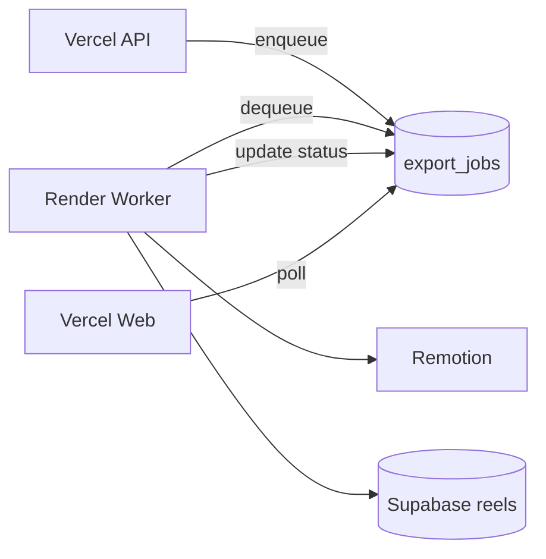

# Render Worker Architecture (Phase 3)

**Date:** 2026-06-03

---

## Current State

Rendering runs **inside** the Next.js API route via `waitUntil(orchestrateRemotionReel)`. No separate process claims jobs from a queue.

| Piece | Today |
|-------|-------|
| Queue table | `export_jobs` (queued → rendering → completed) |
| Dequeue | Stub in `lib/queue/render-queue.ts` |
| Progress cache | `job-store` memory/tmp |
| Deploy target | Same Vercel project as web |

---

## Problems

- 300s function ceiling vs 5–15 min encodes
- Memory spikes (Chromium + Remotion)
- Cold start loses `job-store` (mitigated by `export_jobs`)
- Cannot scale render horizontally independently of web traffic

---

## Root Cause

Serverless-first deployment without a **compute-isolated worker** tier.

---

## Target Architecture

### Worker options

| Option | Pros | Cons |
|--------|------|------|
| Railway / Fly.io container | Full FFmpeg/Chromium, long jobs | Ops overhead |
| Vercel Sandbox / separate project | Same vendor | Still duration limits |
| AWS Lambda + container image | Scale | Cold start, setup |
| Modal / Beam GPU | Fast spinup | Cost, vendor lock |

**Recommendation:** Fly.io or Railway **single container** with `node` worker script polling `export_jobs` via Supabase service role.

---

## Worker Contract

1. `dequeue`: `SELECT … WHERE status='queued' FOR UPDATE SKIP LOCKED LIMIT 1`
2. Set `rendering`, run `orchestrateRemotionReel`
3. On success: `completed`, `render_url`, `metadata.storagePath`
4. On failure: `failed`, `error`
5. Heartbeat every 30s while `rendering`

---

## Still Requires External Deployment

- Worker container + service role key
- `SUPABASE_SERVICE_ROLE_KEY` on worker only
- Health check + restart policy
- Optional Redis for rate limiting (not required for MVP worker)
