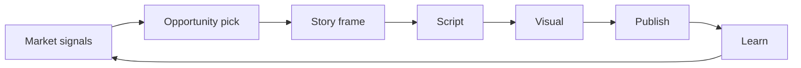

# Module 1 — Vision Understanding

**Course:** Mugtee V5 Evolution (Builder + Teacher)  
**Status:** Complete (Phase 1)  
**Audience:** Founders, builders, and teachers onboarding to Mugtee Evolution  
**Duration:** ~45–60 minutes read + reflection exercises

---

## Objective

By the end of this module you will be able to:

1. State the **locked V5 product vision** in one sentence and one pipeline diagram.
2. Explain what Mugtee **is** and **is not** today versus where V5 is going.
3. Identify which existing repo systems already support each V5 phase — and which are still gaps (documentation only; no implementation in Phase 1).

---

## Context

Mugtee AI Studio began as a **faceless video creation tool** (hook → script → scenes → voice → export) and accumulated intelligence layers (memory, companion, agent feed, missions). V5 Evolution reframes the product as an **Intelligence Layer for Faceless Creators**: creators do not start from a blank prompt; they start from **market-grounded opportunity**, then move through a closed loop that **learns** from what they publish.

Phase 1 of the Evolution Master Prompt is **analysis and teaching only**. No Opportunity Engine implementation, no new product phases shipped, and no breaking changes to production code.

---

## Prerequisites

- Read access to the Mugtee AI Studio repository
- Familiarity with short-form video (Reels, Shorts, TikTok) and “faceless” channels
- Optional: skim [COMPANION_V1.md](../COMPANION_V1.md) and [current-architecture.md](../current-architecture.md) after this module

---

## Locked V5 vision

### Tagline

**Intelligence Layer for Faceless Creators**

### Canonical pipeline

```
Market → Opportunity → Story → Script → Visual → Publish → Learn
```

| Phase | Meaning for creators |
|-------|---------------------|
| **Market** | What is trending, underserved, or winning in their niche *right now* |
| **Opportunity** | A scored, actionable angle — not a generic idea list |
| **Story** | Narrative frame: hook arc, beats, emotional payoff, story bible |
| **Script** | Spoken narration + structure tuned to platform retention |
| **Visual** | Storyboard, motion, style continuity |
| **Publish** | Export MP4 + captions + platform handoff (YouTube, Buffer, etc.) |
| **Learn** | Outcomes feed memory — next opportunity and story improve |

### What Mugtee IS (V5 direction)

- A **creator operating system** that reduces decision fatigue before the first word of script is written
- An **intelligence layer** that sits above generation APIs (OpenAI, Gemini, Flux, ElevenLabs, Remotion)
- A **closed loop**: publish and performance data (even lightweight) inform the next opportunity
- A **teacher + builder** product: founders ship phases; the course teaches why each phase exists

### What Mugtee IS NOT

- Not a generic “ChatGPT for video” with no market context
- Not only a video editor (timeline exists but is not the V5 center of gravity)
- Not a full production agency OS for live shoots (legacy Table Tales workspace remains but is not V5 core)
- Not a finished Opportunity Engine **today** — Phase 1 documents gaps; Phase 2+ builds it after approval
- Not a replacement for platform analytics suites — it **interprets** signals for the next creative move

---

## Micro-Steps

### Step 1.1 — Memorize the pipeline

Write the seven words on paper: **Market, Opportunity, Story, Script, Visual, Publish, Learn**.  
For each word, note one question a faceless creator asks at that step (e.g. Market: “What’s working in my niche this week?”).

### Step 1.2 — Map “today” vs “V5”

| V5 phase | What exists in repo today (Phase 1 analysis) |
|----------|-----------------------------------------------|
| Market | Virlo engine, content angles, niches, deep research — **no** live market API |
| Opportunity | `lib/agent/opportunity-radar.ts`, `creator_opportunities` (0043) — **template** feed |
| Story | Story bible, script beats, cinematic prompts |
| Script | `generate-script` + AI provider router |
| Visual | `generate-images`, image providers, scene motion jsonb |
| Publish | Remotion reel export, YouTube, Buffer — **MP4 reliability gap** |
| Learn | Memory OS (0042), analytics events — **weak** auto-close loop |

### Step 1.3 — Draw your creator journey



Ask: *Where does Mugtee interrupt the creator with intelligence today?* (Answer: mostly at Script/Visual via prompts; lightly at Opportunity via sidekick/home feed.)

### Step 1.4 — Define success for V5

V5 success is not “more API routes.” It is:

- Creators **start from an opportunity**, not a blank box
- Each phase has **measurable quality** (score, gate, or validation)
- **Learn** changes the next Opportunity without manual reset

### Step 1.5 — Anti-goals (Phase 1)

Do **not** in Phase 1:

- Implement Opportunity Engine
- Add new product phases to routing
- Break Quick Cut / cinematic export paths
- Conflict with in-flight Template Discovery subagent work

---

## Expected Result

You can teach Module 1 to another builder in 10 minutes using:

1. The tagline: *Intelligence Layer for Faceless Creators*
2. The seven-phase pipeline
3. A honest “today vs V5” table without overselling current opportunity features

---

## Validation

| Check | Pass criteria |
|-------|----------------|
| V1 | Recite pipeline order without notes |
| V2 | Name two things Mugtee is NOT |
| V3 | Point to one repo path for Opportunity **scaffold** (`lib/agent/opportunity-radar.ts`) and state it is not full Market→Opportunity yet |
| V4 | Explain why Phase 1 is docs-only |

---

## Common Errors

| Error | Symptom |
|-------|---------|
| **Pipeline skip** | Treating “hook generation” as Market — hook is Script-adjacent, not market research |
| **Feature = phase** | Calling `/home` companion “the Learn phase” — it’s a surface, not the full loop |
| **Oversell radar** | Telling creators opportunities are live market data — they are personalized templates + scores today |
| **Editor-first** | Planning V5 around timeline editor only — V5 is intelligence-first, export second |
| **Phase 1 scope creep** | Implementing radar changes during analysis sprint |

---

## Error Diagnosis

| If you hear… | Likely misunderstanding |
|--------------|-------------------------|
| “We already have opportunities on /home” | UI exists; engine is not external market-backed |
| “MP4 export is Publish done” | Publish includes reliable artifact + platform handoff + learn signals — export audit shows MP4 gap |
| “Memory OS = Learn complete” | Tables exist; automatic publish → model update does not |
| “Quick Cut is the whole product” | Quick Cut is the strongest **Visual→Publish** path; Market→Opportunity needs Phase 2+ |

---

## Error Resolution

1. Re-read **Locked V5 vision** and redraw the loop with **Learn → Market** feedback explicit.
2. Open [current-architecture.md](../current-architecture.md) §11 Gaps — align language with documented gaps.
3. When proposing features, tag them with a **pipeline phase**; reject orphan features with no phase.
4. Defer implementation questions to **Phase 2 approval** from the user/stakeholder.

---

## Evolution Impact

Module 1 sets the **non-negotiable vocabulary** for all 25 training modules and the future CustomGPT (“Mugtee Evolution Architect”). Every later module (Architecture, Opportunity Engine, Story Intelligence, etc.) must reference the same seven phases. Drift in naming (e.g. “idea” vs “opportunity”) will fragment builder and teacher tracks.

**Phase 2 trigger:** User approval after Phase 1 deliverables (architecture doc, modules 1–2, course index, commit on `main`).

---

## Quick reference card

```
VISION:  Intelligence Layer for Faceless Creators
PIPELINE: Market → Opportunity → Story → Script → Visual → Publish → Learn
PHASE 1:  Document & teach — do not implement Opportunity Engine
TODAY:    Strong Script/Visual; scaffold Opportunity; weak Market & Learn closure
```

---

*Next: [MODULE_02_ARCHITECTURE.md](./MODULE_02_ARCHITECTURE.md)*
